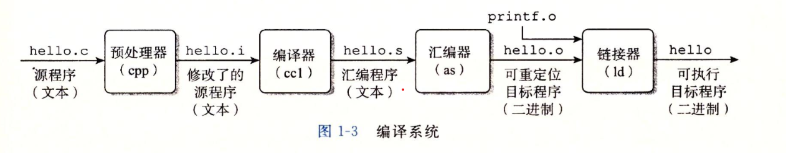
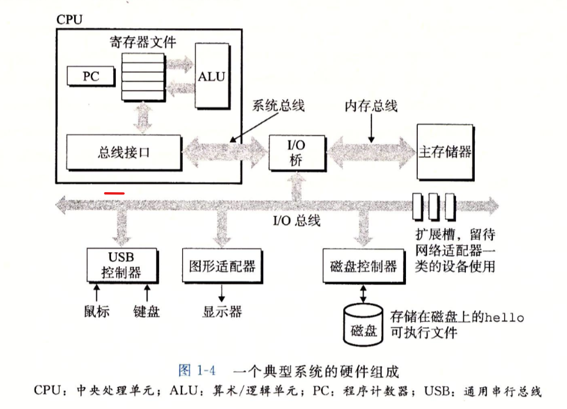
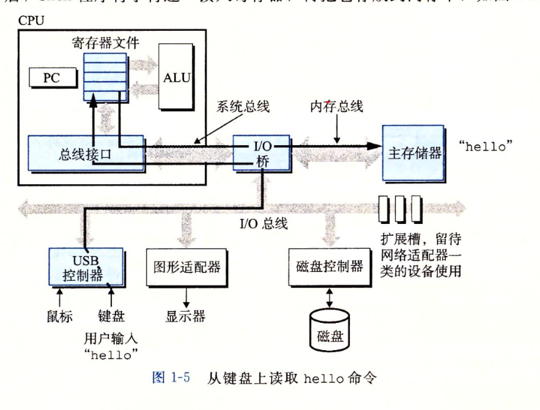
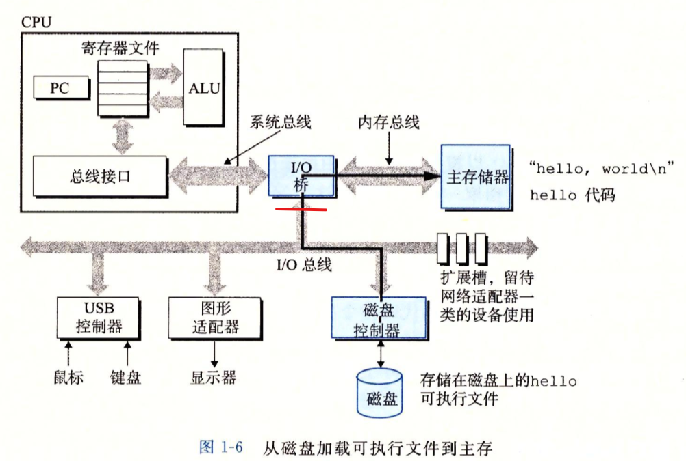
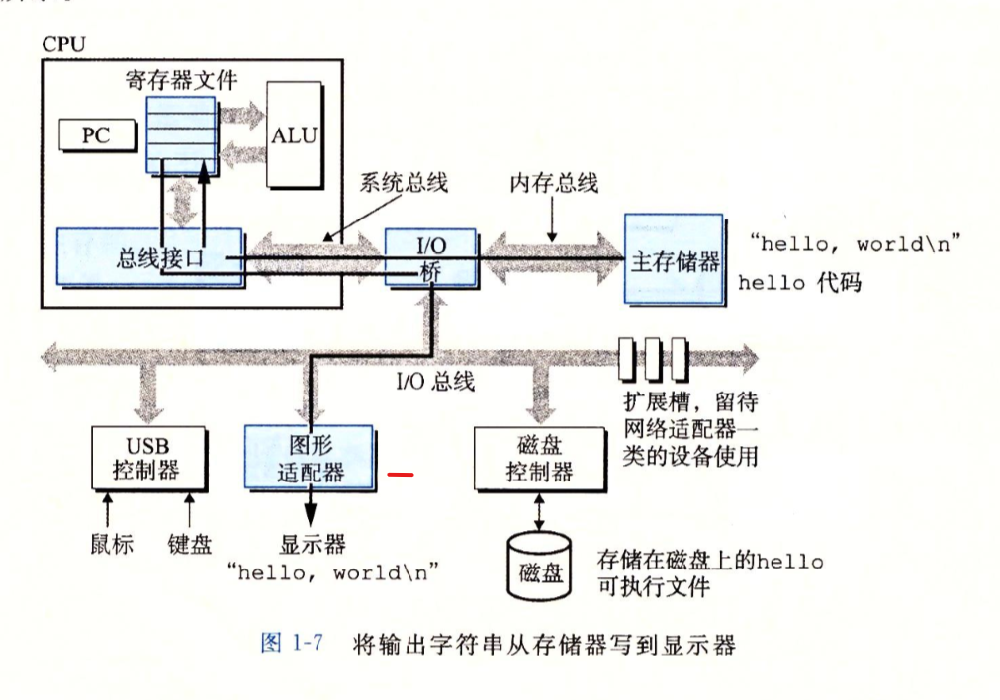
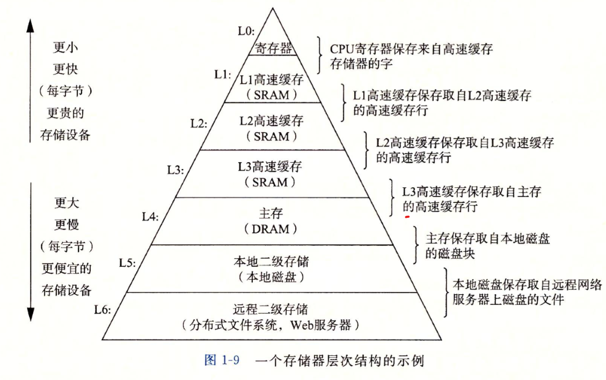
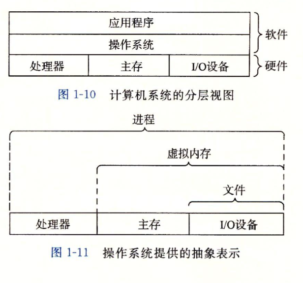
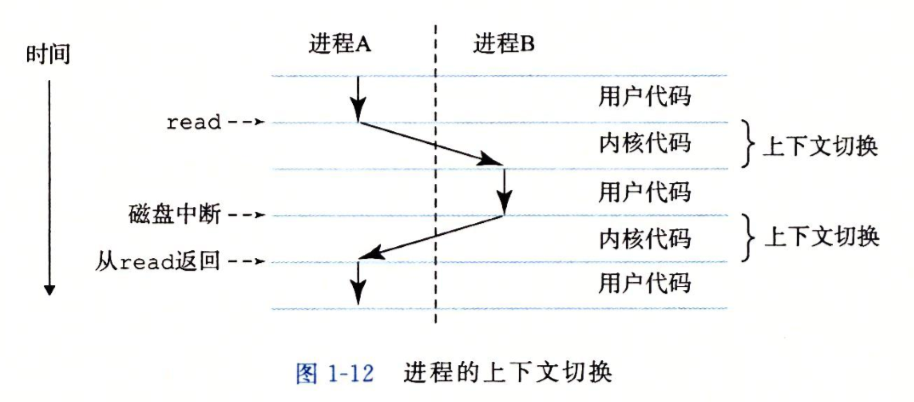
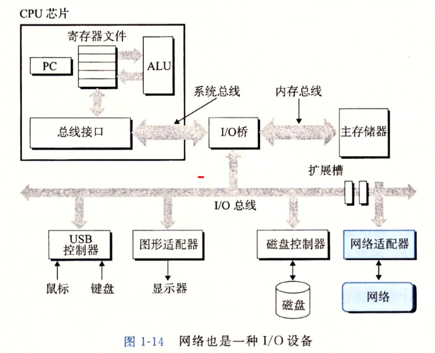

# 深入理解计算机操作系统(一) -- 计算机系统

这里先给出一段c的代码

```c
#include <stdio.h>

int main() {
    printf("Hello,World!");
    return 0;
}
```

可以看出这就是一段普通的字符，并没有什么特别之处，那么这又是怎么编译成能够被运行的程序呢?

## 程序被翻译成其他的格式

对于高级程序语言来说，其能够被`编译器`转化为一系列`低级机器语言`指令，并且之后被按照一种`可执行目标程序`打包为`二进制文件`，这样就完成了程序的编译



- 预处理阶段
预处理器将引用的库文件进行`展开`，并对原c程序进行修改，得到完整的源程序

- 编译阶段
编译器将`.i`文件翻译为低级机器语言，得到一个包含`汇编语言程序`的文本文件

- 汇编阶段
汇编器将汇编语言程序翻译为机器语言，并打包在一个后缀为`.o`的二进制文件中

- 链接阶段
链接器将其他外部引用的函数所编译成的.o文件与前一步编译好的文件结合起来，形成`可执行目标文件`

> 可以通过gcc来编译并查看这些中间文件

```bash
gcc hello.c -save-items -m32 -o hello
```

## 程序在系统中的运行

### 系统的硬件组成



1. 总线
总线是系统中携带信息字节并在各个部件间传递的设备

2. I/O设备
I/O设备是系统与外界世界的联系通道，且每一个I/O设备均通过一个`控制器`或`适配器`与I/O总线相连

3. 主存
主存是临时存储设备，能够存储程序运行期间处理的数据和程序本体

4. 处理器
CPU能够不断地处理来自主存中的指令，在任何时刻其中的`程序计数器`均指向某条机器语言指令

### 程序的运行过程

首先当我们从键盘等I/O设备输入命令时，shell会先把字符逐一读入寄存器，再将其放到内存中



之后在完成输入后，shell会从磁盘中加载我们所输入的文件到主存中



在完成加载到主存中后，程序就能够执行并进行输出了



## 操作系统与硬件

### 高速缓存

不同I/O设备间的速度是不同的，同时与系统内部硬件的速度更是有很大的区别

为了使不同速度的硬件能够互相协调，我们引入了`高速缓存`这个结构，同时每个计算机系统中的存储设备均被组织成了一个存储器层次结构



### 操作系统管理硬件

操作系统位于`硬件和应用程序之间`，是用户通过应用程序操作硬件的一种`接口`，同时能够协调两边的活动



操作系统主要有以下两种作用

1. 防止硬件被失控的应用程序滥用
2. 向应用程序提供一种机制来控制复杂而大不相同的低级硬件设施

#### 进程

`进程`是操作系统对正在运行程序的一种`抽象`。在一个操作系统上能够同时运行多个进程

对于单核处理器来说，不同进程间的指令是交错执行的，这个称为是`并发运行`，同时这种交错执行的机制称为是`上下文切换`



可以看出上下文切换是在`内核态`的时候所发生的，操作系统能够保存前一进程的状态，并待另一进程运行完成后恢复前一进程的数据

同时进程能够通过`系统调用`(system call)来调用操作系统内的操作

#### 线程

一个进程能够由多个称为`线程`的执行单元组成，同时线程之间能够共享数据

#### 虚拟内存

<https://www.cnblogs.com/yaoxiaowen/p/7805964.html>

#### 文件

文件就是一种`字节序列`，任何**一种I/O设备均可以被看作是一种文件**，同时输入输出即可通过调用这些文件来实现

#### 网络



网络适配器也是一种I/O设备，通过交互能够将网络通信内容**加载到主存**当中

## 程序快速运行的基础

这里我们先要区分开并发和并行的含义

- 并发：指可以同时具有多个活动的系统
- 并行：指使用并发使系统运行地更快

### 线程级并发

并发的实质是**一个物理CPU**(也可以多个物理CPU)在若干道程序之间`多路复用`，并发是对有限物理资源强制行使多用户共享以提高效率。

> 并发当有多个线程在操作时,如果系统只有一个CPU,则它根本不可能真正同时进行一个以上的线程，它只能把CPU运行时间划分成若干个时间段,再将时间段分配给各个线程执行，在一个时间段的线程代码运行时，其它线程处于挂起状

### 指令级并行

`并行`指两个或两个以上事件或活动在**同一时刻发生**。在多道程序环境下，并行性使多个程序同一时刻可在**不同**CPU上**同时**执行

> 当系统有一个以上CPU时,则线程的操作有可能非并发。当一个CPU执行一个线程时，另一个CPU可以执行另一个线程，两个线程互不抢占CPU资源，可以同时进行，这种方式我们称之为并行

### 串行

除了并行之外，我们还有`串行`这种任务的执行方式

串行是指多个任务时，各个任务按**顺序执行**，完成一个之后才能进行下一个

### 同步和异步

指的是能否开启`新的线程`。同步不能开启新的线程，异步可以。异步和同步是相对的

- `同步`就是**顺序执行**，执行完一个再执行下一个，需要等待、协调运行
- `异步`就是彼此独立, 在等待某事件的过程中继续做自己的事，**不需要等待**这一事件完成后再工作，减小IO阻塞对程序运行速度的减慢

### 小结

**线程就是实现异步的一个方式**

异步是让调用方法的主线程不需要同步等待另一线程的完成，从而可以让主线程干其它的事情。异步和多线程并不是一个同等关系, 异步是`最终目的`, 多线程只是我们**实现异步的一种手段**

异步是当一个调用请求发送给被调用者, 而调用者不用等待其结果的返回而可以做其它的事情。实现异步可以采用多线程技术或者交给另外的进程来处理

## 参考资料

- [并发，并行，串行，同步，异步？](https://juejin.im/post/6844904159292948487)
- [什么是内存（一）：存储器层次结构](https://www.cnblogs.com/yaoxiaowen/p/7805661.html)
- [什么是内存(二)：虚拟内存](https://www.cnblogs.com/yaoxiaowen/p/7805964.html)
