# 深入理解计算机操作系统(二) -- 信息

现代计算机主要使用二进制来表示信息。当每一个二进制数字`(位[bit])`被组合起来后，再加上某种解释，就能够表示出`任何有限集合的元素`

同时我们需要注意的是，能够用来表示位是**有限的**，且其在不同架构的计算机中是不同的，如果运算结果或者参与运算的元素**超过了这一限制**，运算就会发生`溢出`，产生某些神奇的错误

## 信息存储

计算机存储的最小单位为比特(bit)，**8bit**组成一个`字节`(byte)，为最小的可寻址的内存单位

对于程序来说，其会将内存视作`字节数组`，也就是`虚拟内存`，内存的每一个字节均会有一个对应的`地址`

> 对于c中的指针，其值均指向某个存储块的第一个字节的虚拟地址

### 十六进制表示法

对于字节来说，其由8个比特组成，用二进制表示的话太长了，用十进制表示的话转化转换不方便，而用十六进制的话恰好**每四个字节**能够划分为一组，表示十分方便

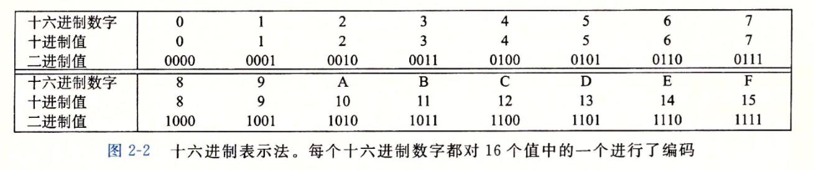

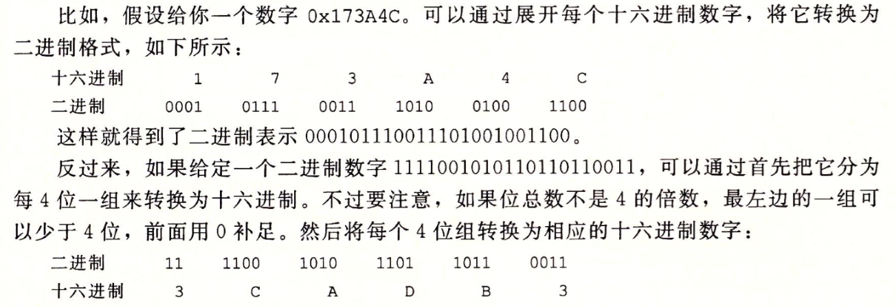

### 字数据大小

对于不同架构的机器来说，其能访问的`虚拟地址空间`的长度也不同

例如对于x86架构的机器来说，其能访问$1 - (2^{32} - 1)$范围的地址，为4GB，而对x64架构来说则能访问$1 - (2^{64} - 1)$范围，约为16EB大小的空间

> 不同的字长是由于寄存器长度的不同而形成的，同时不同长度之间向下兼容

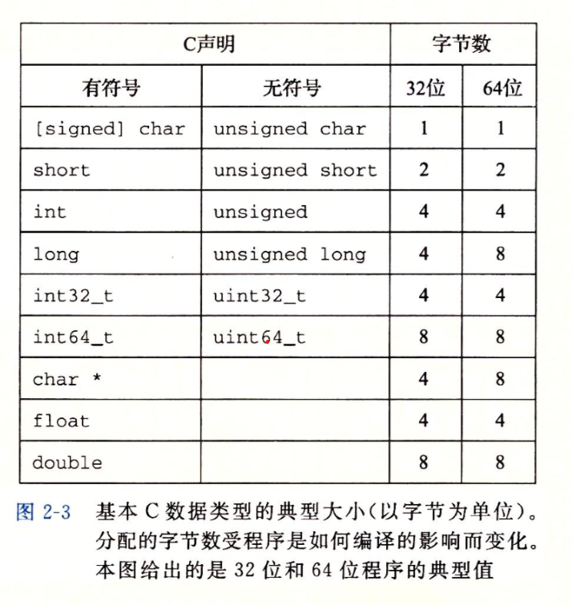

> 在编写程序时需要注意不同架构下的兼容性问题

### 寻址与字节顺序

对于一个复杂的应用程序来说，我们必须考虑如何在内存中存储这些对象

> 对于一个w位的整数来说，其位表示为$[x_{w-1}, x_{w-2}, ... , x_1, x_0]$，其中`最高有效字节`包括$[x_{w-1}, ... , x_{w-8}]$，`最低有效字节`为$[x_7, ... , x_1]$

对于对象的排列来说有两种顺序

- 最低有效字节在前，称为`小端法`
- 最高有效字节在前，称为`大端序`

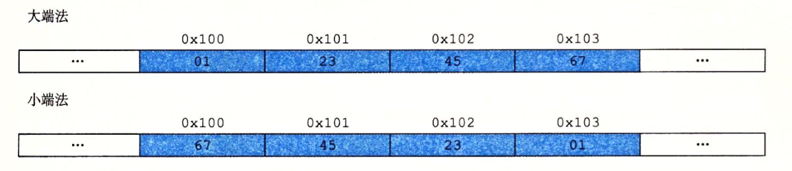

查看大小端可以用c语言来查看

```c
#include <stdio.h>

typedef unsigned char *byte_pointer;

void show_bytes(byte_pointer start, size_t len) {
    for (size_t i = 0; i < len; i++) {
        printf("%.2x", start[i]);
    }
    printf("\n");
}

int main() {
    show_bytes(100, sizeof(int));
    return 0;
}
```

### 布尔代数

布尔代数是为了研究`逻辑推理`的基本原则，将逻辑值`True`和`False`分别编码为`0`和`1`

同时布尔代数支持逻辑上的运算，即`非，异或，与，或`

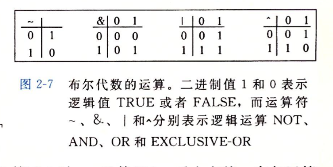

在将布尔代数拓展为`位向量`之后，这种运算依然成立

> 型如$[a_{w-1}, ... , a_0]$的编码集合称为是位向量

### 位级运算

> 和布尔运算一样吧

### 逻辑运算

与位级运算不同，这个逻辑运算是指**整体逻辑上**的成立与否，能够以True或False的形式进行输出

一般提供了`||(or)`, `&&(and)`, 和`!(not)`三种逻辑运算方式

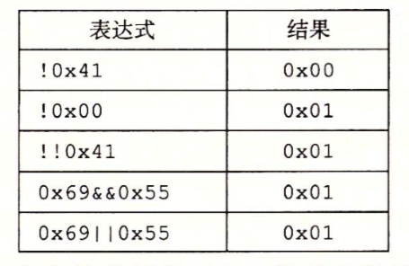

### 移位运算

`移位`表示位向量中每个比特向某个方向整体移动n位，自动舍弃超出的位，并在不足的位置上自动**补足**

对于右移来说，其分为以下两种类型

- 逻辑右移：向左端补齐0
- 算术右移：在左端补齐最高有效位的值

## 整数表示

### 整型数字类型

对于c来说，c中具有多种整型数据类型，每种关键字均能用关键字来指定大小

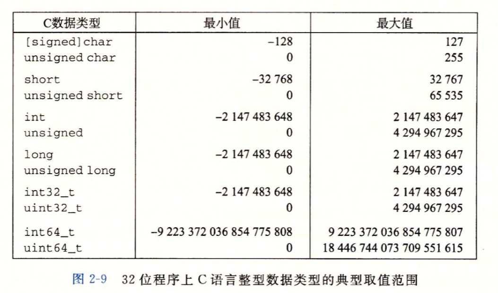

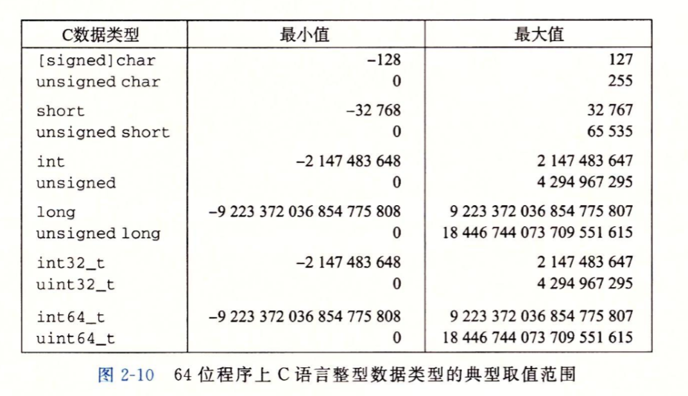

> 可以看到正数和负数的取值范围是不同的，这与负数的表示方式相关

### 整型编码

#### 无符号数字的编码

对于一个整形数据来说，我们可以将其的每一位组合成一个位向量$\vec x$，且内部结构为$[x_{w-1}, ... , x_0]$

这样看来我们可以这样来定义无符号数(使用$B2U_w$函数来实现)

$$
B2U_w(\vec{x}) = \sum_{i=0}^{w-1}x_i2^i
$$

需要我们注意的是

- 当我们指定一个数量是无符号类型时，那么其最高位的1或0，和其它位一样，用来表示该数的大小

#### 有符号数字的编码

与无符号数字相似，其也是通过位的运算所得出的结果，但是最高位不再指定数字的大小，而是表示符号

这种表示方式称为是`补码`

$$
B2U_w(\vec{x}) = -x_{w-1} + \sum_{i=0}^{w-2}x_i2^i
$$

### 整形表示的特点

对于`WORD`类型的数字来说

||Decimal|Hex|Binary||
|:--:|:--:|:--:|:--:|:--:|:--:|
|UMax|65535|FF FF|1111 1111 1111 1111|2^16 - 1|
|TMax|32767|7F FF|0111 1111 1111 1111|2^15 - 1|
|TMin|-32768|80 00|1000 0000 0000 0000|-2^15|
|-1|-1|FF FF|1111 1111 1111 1111||
|0|0|00 00|0000 0000 0000 0000||

拓展到任意长度的均可这样表示

可以得到

- $|T_{min}|=T_{max}+1$
- $|U_{max}|=2*T_{max}+1$

有符号数和无符号数在非负数的编码是一样的，每一个数字的编码是唯一的，这两者可以互换

- $U2B(x)=B2U−1(x)$
- $T2B(x)=B2T−1(x)$

### 类型转换


当我们在有符号和无符号类型之间进行转换时

- 位值不变，只是改变了解释这些位的方式
- 如果一个表达式既包含有符号数也包含无符号数，那么会被隐式转换成无符号数进行比较

其余情况下按着这个数轴进行一一对应

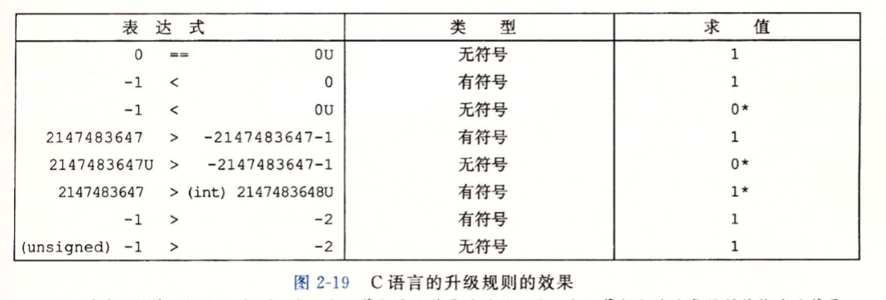

> 在编写c语言程序时务必要注意数字类型的比较

> 不只是整型之间的转换，c中整型向size_t, char等的类型进行转换时也要注意符号带来的影响

### 增与减

增与减都代表了程序自身理解内存方式的变化

#### 拓展数字的位表示

- 无符号数字只要向表示的开头加`0`即可
- 有符号数字需要向表示的开头加`1`

#### 截取数字

- 对于无符号数字，丢弃相应位数，相当于 $x mod 2^k$
- 对于有符号数字，丢弃相应位数，最高位作为符号位继续表示

### 整型运算

#### 溢出

数值的范围可以看作是一个首尾相接的圆，超出了返回就会向相接的部分发生变化

- 从最大正数部分溢出到负数称为是`正溢`
- 从最小负数部分溢出到正数称为是`负溢`

#### 运算

> 公式部分就不想写了，感觉看了也没啥用。。。

整数运算就是**位的运算**，也是一种**模运算形式**

特别是乘法与除法，在不涉及浮点数时，其本质在O1优化下可以很容易地看出是`加法与减法的结合体`

## 浮点数

浮点数的出现补足了计算机数值运算的`"空缺"`，能表示出接近0的数字，也能表示出非常大的数字，这些都是浮点数的特殊结构所带来的特别之处

> 需要注意的是，浮点数的特殊结构决定了其只能是`近似结果`

### 浮点数的表示

#### 定点表示法

作为特殊的一类数字，我们仍能使用整数的表示方法来对浮点数进行编码

以点为界，左为整数的表示法，从右开始每位的权由`-1`依次减一，这就表示出了一个简单的浮点数

$$d = \sum_{i=-n}^{m}10^{i} * d_{i}$$

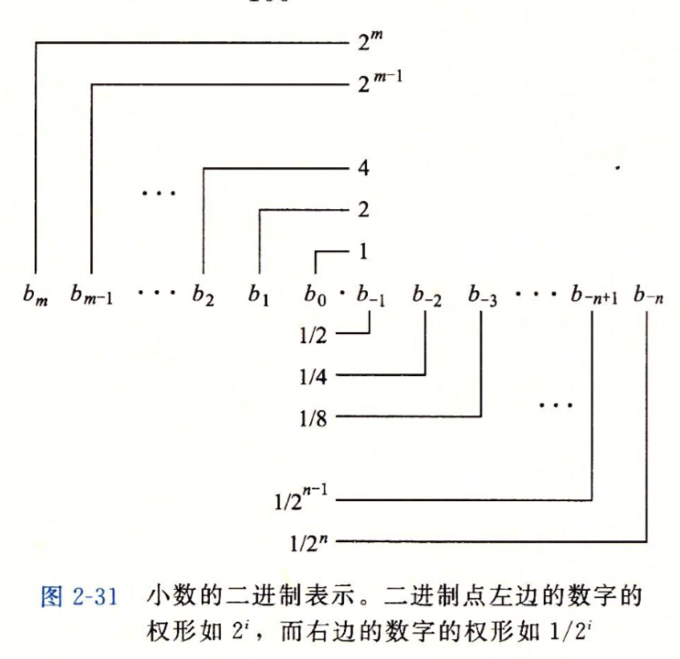

同时很明显的是，这样只能表示出形如$x * 2^y$的数字，对于0.20之类的小数并不能准确表示

#### IEEE 754

`IEEE 754`标准用$V=(-1)^s*M*2^e$来表示一个数字

- `符号s`，决定了最后的符号
- `尾数`，M是一个二进制小数，范围是
- `阶码`，对浮点数加权

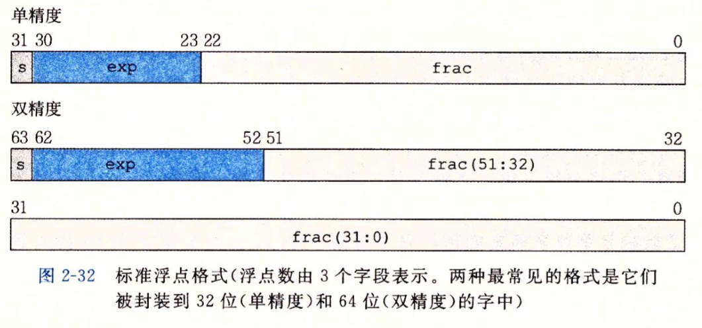

同时根据给出的exp的值，被编码的值可以分为三种不同的情况

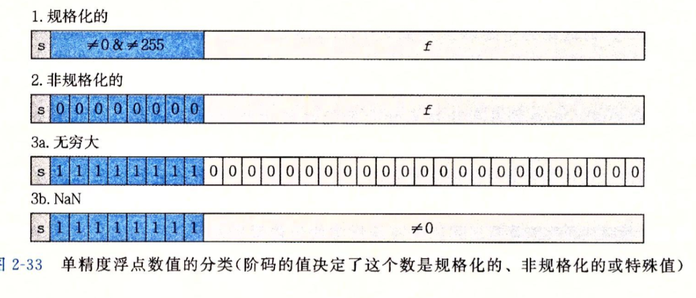

> 所以说0.1+0.2为啥不等于0.3就是这个原因

## Reference

[【读薄 CSAPP】壹 数据表示](https://wdxtub.com/csapp/thin-csapp-1/2016/04/16/)

---

## 对应Lab

- [ ] datalab
