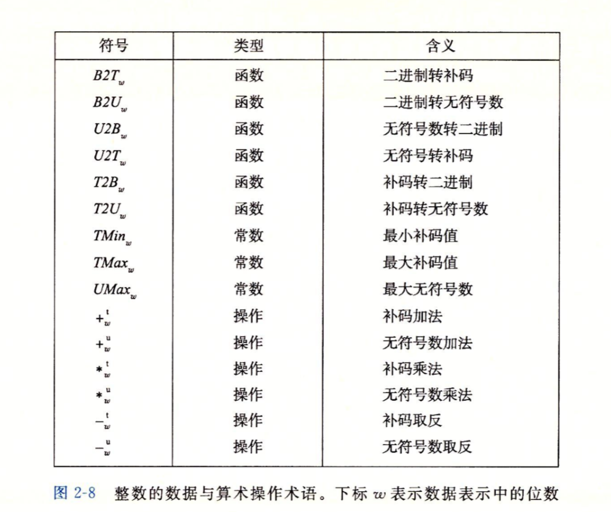

# 深入理解计算机操作系统(二) -- 信息

现代计算机主要使用二进制来表示信息。当每一个二进制数字`(位[bit])`被组合起来后，再加上某种解释，就能够表示出`任何有限集合的元素`

同时我们需要注意的是，能够用来表示位是**有限的**，且其在不同架构的计算机中是不同的，如果运算结果或者参与运算的元素**超过了这一限制**，运算就会发生`溢出`，产生某些神奇的错误

## 信息存储

计算机存储的最小单位为比特(bit)，**8bit**组成一个`字节`(byte)，为最小的可寻址的内存单位

对于程序来说，其会将内存视作`字节数组`，也就是`虚拟内存`，内存的每一个字节均会有一个对应的`地址`

> 对于c中的指针，其值均指向某个存储块的第一个字节的虚拟地址

### 十六进制表示法

对于字节来说，其由8个比特组成，用二进制表示的话太长了，用十进制表示的话转化转换不方便，而用十六进制的话恰好**每四个字节**能够划分为一组，表示十分方便

### 字数据大小

对于不同架构的机器来说，其能访问的`虚拟地址空间`的长度也不同

例如对于x86架构的机器来说，其能访问$1 - (2^{32} - 1)$范围的地址，为4GB，而对x64架构来说则能访问$1 - (2^{64} - 1)$范围，约为16EB大小的空间

> 不同的字长是由于寄存器长度的不同而形成的，同时不同长度之间向下兼容

> 在编写程序时需要注意不同架构下的兼容性问题

### 寻址与字节顺序

对于一个复杂的应用程序来说，我们必须考虑如何在内存中存储这些对象

> 对于一个w位的整数来说，其位表示为$[x_{w-1}, x_{w-2}, ... , x_1, x_0]$，其中`最高有效字节`包括$[x_{w-1}, ... , x_{w-8}]$，`最低有效字节`为$[x_7, ... , x_1]$

对于对象的排列来说有两种顺序

- 最低有效字节在前，称为`小端法`
- 最高有效字节在前，称为`大端序`

### 布尔代数

布尔代数是为了研究`逻辑推理`的基本原则，将逻辑值`True`和`False`分别编码为`0`和`1`

同时布尔代数支持逻辑上的运算，即`非，异或，与，或`

在将布尔代数拓展为`位向量`之后，这种运算依然成立

> 型如$[a_{w-1}, ... , a_0]$的编码集合称为是位向量

### 位级运算

> 和布尔运算一样吧

### 逻辑运算

与位级运算不同，这个逻辑运算是指**整体逻辑上**的成立与否，能够以True或False的形式进行输出

一般提供了`||(or)`, `&&(and)`, 和`!(not)`三种逻辑运算方式

### 移位运算

`移位`表示位向量中每个比特向某个方向整体移动n位，自动舍弃超出的位，并在不足的位置上自动**补足**

对于右移来说，其分为以下两种类型

- 逻辑右移：向左端补齐0
- 算术右移：在左端补齐最高有效位的值

## 整数表示

### 整型数字类型

对于c来说，c中具有多种整型数据类型，每种关键字均能用关键字来指定大小

> 可以看到正数和负数的取值范围是不同的，这与负数的表示方式相关

### 无符号数字的编码

对于一个整形数据来说，我们可以将其的每一位组合成一个位向量$\vec x$，且内部结构为$[x_{w-1}, ... , x_0]$

这样看来我们可以这样来定义无符号数(使用$B2U_w$函数来实现)

$$
B2U_w(\vec{x}) = \sum_{i=0}^{w-1}x_i2^i
$$

且无符号数字编码具有唯一性

### 补码

