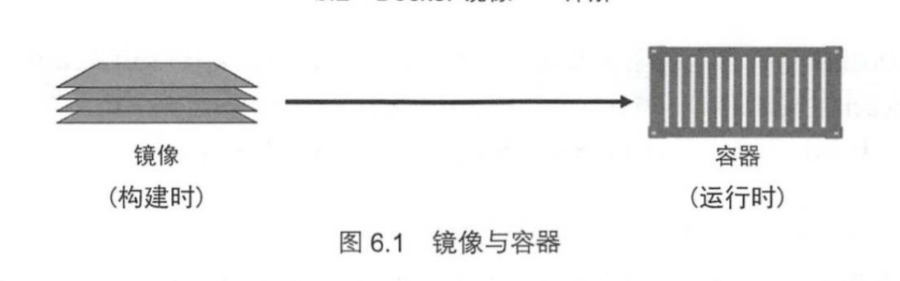
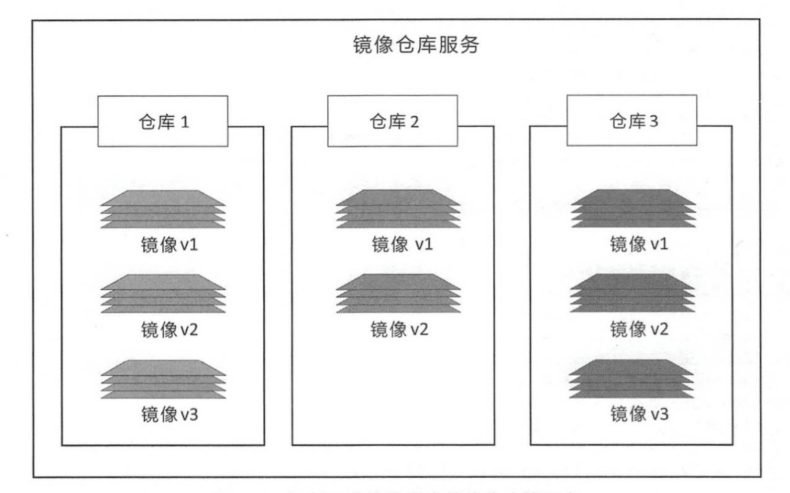
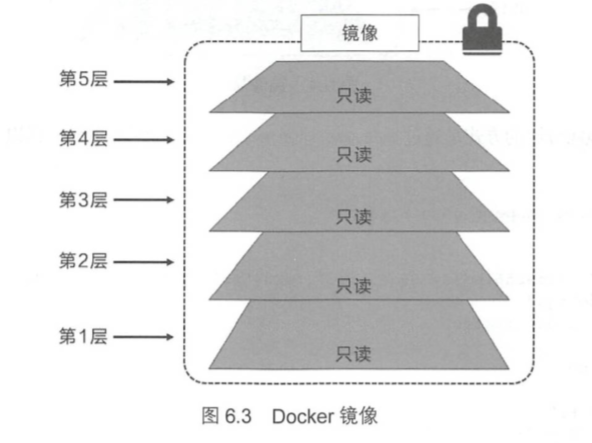
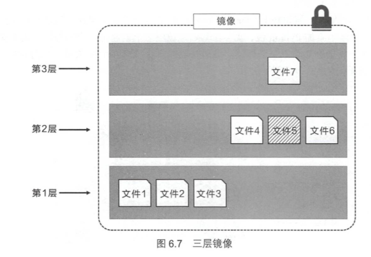
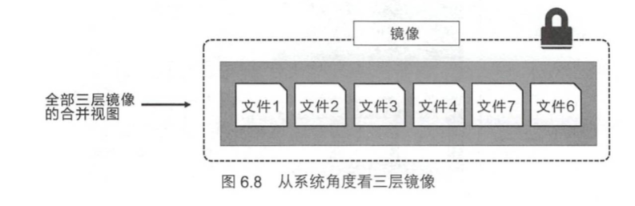

# docker 基本操作(一)：镜像

## 何为镜像

镜像是Docker的三大组件之一，且是容器运行的基础

我们可以把镜像看作是虚拟机运行所需要的**镜像文件**

> Docker的镜像采用分层存储，以保证高效传输，且每一层都可以看作是独立的对象



> 在windows上docker分为`windows容器`和`linux容器`，而在linux上只能运行linux容器

## 使用docker镜像

### 获取docker镜像

`Docker Hub`上存放着大量优质的docker镜像，这里我们使用`docker pull`即可从仓库拉取镜像

```bash
dokcer pull [选项] [Docker Registry地址[:端口号]/]仓库名[:标签]
```

- docker registry地址
  - 地址的格式一般是`<域名/IP>[:端口号]`，默认地址是**DockerHub**
- 仓库名
  - 仓库名是两段式名称，即`<用户名>/<软件名>`
- 标签
  - 标签代表着镜像的版本，若未指定标签，则默认的是`lastest`

这里给出一个示例

```text
# m1904 at 404-NOT-FOUND in ~ inside env:base [22:32:42]
➜ docker pull mattrayner/lamp:latest
latest: Pulling from mattrayner/lamp
c64513b74145: Pull complete
01b8b12bad90: Pull complete
c5d85cf7a05f: Pull complete
b6b268720157: Pull complete
e12192999ff1: Pull complete
d39ece66b667: Pull complete
65599be66378: Pull complete
1a01f9d0f080: Pull complete
```



从这里可以看出docker的镜像存储是分层的

### 列出镜像

使用`docker image ls`即可列出已经下载完成的镜像文件，同时我们也可以使用`docker images`来进行等效替代

```text
# m1904 at 404-NOT-FOUND in ~ inside env:base [22:34:17]
➜ docker images
REPOSITORY           TAG                 IMAGE ID            CREATED             SIZE
mattrayner/lamp      latest              05750cfa54d5        10 days ago         915MB
kminthein/lkwa       latest              18591064069a        5 months ago        230MB
acgpiano/sqli-labs   latest              0976afc45249        4 years ago         434MB
```

列表包含了`仓库名`、`标签`、`镜像ID`、`创建时间`以及`所占用的空间`

> 要查看现在docker现在占用磁盘的真实情况，可以使用`docker system df`来进行查看

```text
# m1904 at 404-NOT-FOUND in ~ inside env:base [21:55:10]
➜ docker system df
TYPE                TOTAL               ACTIVE              SIZE                RECLAIMABLE
Images              2                   1                   664.5MB             230.2MB (34%)
Containers          1                   1                   89.75kB             0B (0%)
Local Volumes       2                   2                   30.47MB             0B (0%)
Build Cache         0                   0                   0B                  0B
```

#### 虚悬镜像(dangling image)

我们有时能在镜像列表中看到名称为`<none>`的镜像，这类镜像通常是由旧镜像名称被取消形成。`docker pull`和`docker build`均可产生此类镜像

要单独显示此类镜像，可以使用`docker imgaes -f dangling=true`

此类镜像是已经被废弃的镜像，可以随意删除，我们可以使用`docker image prune`一次性地删除此类镜像

#### 筛选以进行显示

- 根据仓库名列出镜像

```text
# m1904 at 404-NOT-FOUND in ~ inside env:base [23:48:58]
➜ docker image ls mattrayner/lamp
REPOSITORY          TAG                 IMAGE ID            CREATED             SIZE
mattrayner/lamp     latest              05750cfa54d5        10 days ago         915MB
```

- 根据仓库名和tag进行筛选

- `--filter -f`筛选器
    > docker images -f [filter options]

  - since    --列出在某一镜像安装之后安装的镜像
  - before   --列出在某一镜像安装之前安装的镜像
  - label    --列出label为指定值的镜像
  - dangling --列出悬虚镜像

#### 以特定格式进行显示

当我们想对镜像进行批量操作时，通常需要这个镜像的`hash值`来进行操作，当然我们可以使用诸如`awk`之类的工具进行过滤，但也可以使用`docker images -q`直接输出

```text
➜ docker image ls -q
05750cfa54d5
18591064069a
0976afc45249
```

- 使用`--format`能自定义显示的内容
- 使用`--digests`能够显示摘要

### 查看镜像的细节

```shell
docker image inspect <image-name>
```

可以查看镜像的详细信息

### 运行

这里我们使用`docker run`来运行下载好的镜像文件

```shell
docker run -it --rm mattrayner/lamp bash
```

这里讲解下参数的意思

- `-it`: 这里分为两个参数，`-i`: (interactive)交互式操作，`-t`: (terminal)终端，合起来就是启动一个交互式终端
- `--rm`: 说明在推出容器后，容器会自动销毁，不会额外占用系统资源

同时也可以加入以下参数

- `--name <name>`: 指定容器的姓名
- `-d`: 使容器在后台运行
- `-p <src-port>:<local-port>`: 将容器端口映射到主机端口上
- `-P`: 自动为容器分配端口并映射

### 删除镜像

使用`docker rmi [选项] <镜像1> <镜像2> ...`即可完成镜像的删除

> 镜像可以是`长id`，`短id`，`REPOSITORY`，`镜像摘要`

> 同时我们也可以组合命令来进行删除

## 镜像的深层结构

### 镜像的层式结构

docker的镜像是由一些`松耦合`的**只读**镜像层组成的



要组成一个完整的镜像文件，我们首先要有一个`基础镜像`(一般为**最小化的系统镜像**)，之后再在其上增加**其他服务的镜像**

> 对于不同镜像中的重复部分，我们只会在完整的镜像中显示**不重叠的部分**以及重叠文件在分层中**最新版本**





#### 层级共享

前文拉取镜像时候我们可以看到每一层镜像都有其对于的`hash值`(sha256)，而且镜像层级之间的关系是**松耦合**的

这样对于使用了**同一层**的镜像，其能共用这些镜像层

> 这里同一层指的是hash值相同，这个hash散列值是根据层中的内容所得出的，任何对于镜像层的更改都会导致这一值发生更改
