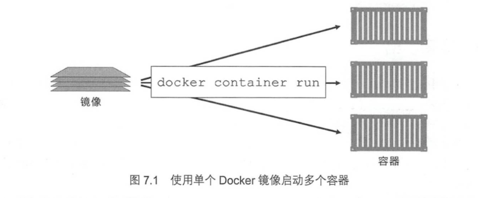

# docker 基本操作(二)：容器

## 何为容器

容器是Docker又一核心概念

简单的说，容器是`独立运行的一个或一组应用，以及它们的运行态环境`。对应的，虚拟机可以理解为模拟运行的一整套操作系统（提供了运行态环境和其他系统环境）和跑在上面的应用



## 如何操作容器

### 启动容器

#### 新建并启动

我们需要`docker run`来运行一个新的容器

```shell
docker run -it --rm mattrayner/lamp bash
```

> 参数的含义已经在上一篇文章中说明

这样我们就新启动了一个容器并为其分配了终端

> 如果我们需要在后台运行容器可以为其加上`-d`参数，要查看输出可以使用`docker logs <container id>`

当我们用`docker run`来创建一个容器时，docker进行了以下操作：

1. 检查本地是否存在指定的镜像，不存在就从公有仓库下载
2. 利用镜像创建并启动一个容器
3. 分配一个文件系统，并在只读的镜像层外面挂载一层可读写层
4. 从宿主主机配置的网桥接口中桥接一个虚拟接口到容器中去
5. 从地址池配置一个	ip	地址给容器
6. 执行用户指定的应用程序
7. 执行完毕后容器被终止

#### 启动已终止容器

可以利用`docker container start <container ID>`命令，直接将一个已经终止的容器启动运行(也可以直接`docker start <container ID>`)

#### 容器的重启策略

容器的自重启是容器在生命周期内对自我的一种修复，可以让容器从异常中自动重启以恢复正常，通常在`docker run`后加上`--restart <option>`选项

这里提供了三种重启选项

- always --除非容器被明确停止，否则会一直尝试重启停止状态的容器
- unless-stopped --与always类似，但是不会再daemon重启后自动重启
- on-failed --只在容器以非0状态码退出时重启，且可以修改尝试重启的次数

### 查看容器运行状态

使用`docker ps`可以查看到所有**正在运行中**的容器

> 要查看所有状态的容器可以加上`-a`选项，显示包括**正在运行的**或者**已经退出**或者**异常状态**的容器

#### 容器的生命周期

容器从运行到销毁有这样的生命周期 -- `创建，运行，休眠，销毁`

在容器的生命周期内，无论容器是运行状态还是休眠状态，其中的内容均能**暂时持久化保存**

只有在销毁镜像时其中的内容才能完全消失

### 终止容器

可以直接使用`docker stop <container ID>`来终止一个正在运行中的容器

或者我们可以使用`docker kill` 来直接杀死一个容器

> `docker stop`和`docker kill`的区别
> 1.docker stop是按照正常流程来关闭容器
> 2.docker kill是直接从当前状态关闭掉容器，相当于linux中的`kill -9`

这里建议用`docker stop`来优雅地停止容器

### 进入容器

当我们使用`-d`来使容器进入后台时，我们需要一些命令来让我们重新进入到容器当中

这里我们尽量使用`docker exec`来进入容器

#### docker attach

- 使用方法

```shell
docker attach <container ID>
```

这样我们就成功为当前容器创建了一个交互式终端

#### docker exec

- 使用方法

```shell
docker exec [options] <container ID>
```

对于options我们常用的选项为`-i`和`-t`，这会为我们分配一个虚拟的交互式终端

而且当我们从这个终端退出时，将**不会**导致`容器的退出`

### 导入和导出容器

#### 导出容器

当我们想要保存某个本地的某个`容器快照`时，我们可以使用`docker export`命令

- 使用方法

```shell
docker export <container ID> > <filename>.tar
```

> 这里比较推荐使用归档格式(tar)来进行保存

#### 导入容器

使用`docker import`就可以从容器快照文件中再导入为镜像

例如我们这里有一个`ubuntu.tar`的容器快照

```shell
cat ubuntu.tar | docker import - <image-name>:tag
```

### 删除容器

使用`docker rm`或者`docker container rm`即可删除一个处于终止状态的容器

> 要删除一个正在运行中的容器，我们可以使用`-d`参数进行删除

#### 清理所有处于终止状态的容器

使用`docker containr prune`可以直接删除所有处于终止状态的容器
