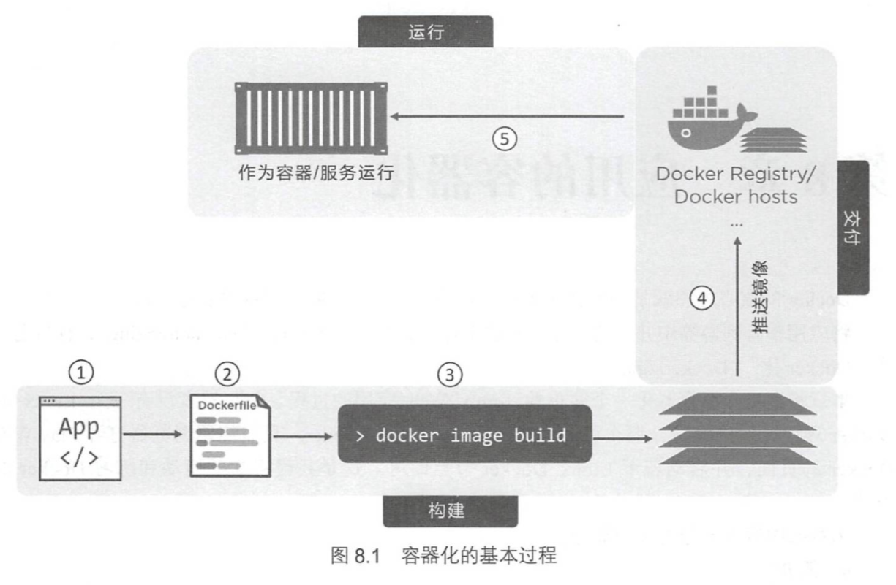

# docker 基本操作(四)：构建应用



作为开发者，如果我们想要把应用快速部署到一个适合的环境中，docker是我们的最佳选择。我们可以将我们的应用整合到一个完整的镜像中，并且使其在容器中能够实际运行

## 镜像的层级说明

这里首先要说明一点，构建应用时的任何一条指令都是在一个**新的分层**上进行的，除全局设置之外，一个层级中的更改与另外一个层级中的内容**无任何关联**

这里可以用`docker history`来查看镜像的构建历史

```text
  docker history d5b9cb21f11b
IMAGE               CREATED             CREATED BY                                      SIZE                COMMENT
d5b9cb21f11b        7 months ago        /bin/bash                                       94.4MB              install cgdb
<missing>           7 months ago        /bin/bash                                       132MB               install less
<missing>           8 months ago        /bin/sh -c apt-get install -y gcc make vim      169MB
<missing>           8 months ago        /bin/sh -c apt-get update                       27.7MB
<missing>           8 months ago        /bin/sh -c #(nop) WORKDIR /csapp-labs           0B
<missing>           8 months ago        /bin/sh -c #(nop) COPY dir:1d5034758df64e9ef…   3.49MB
<missing>           9 months ago        /bin/sh -c #(nop)  CMD ["/bin/bash"]            0B
<missing>           9 months ago        /bin/sh -c mkdir -p /run/systemd && echo 'do…   7B
<missing>           9 months ago        /bin/sh -c set -xe   && echo '#!/bin/sh' > /…   745B
<missing>           9 months ago        /bin/sh -c [ -z "$(apt-get indextargets)" ]     987kB
<missing>           9 months ago        /bin/sh -c #(nop) ADD file:a48a5dc1b9dbfc632…   63.2MB
```

## 应用的容器化

一般来说，要对我们的应用构建一个完整的环境需要进行以下步骤

1. 编写应用代码
2. 创建`Dockerfile`，包括当前应用的描述，依赖以及如何运行这个应用
3. 对该Dockerfile执行`docker image build`命令
4. 构建docker镜像

> 需要注意的是，Dockerfile所编写应用为**单节点应用**

### Dockerfile

首先先指明下`Dockerfile`是干啥用的

1. 对我们所写的应用给出具体信息及运行环境
2. 给出所需镜像层及后续容器中所要自动执行的命令
3. 指导Docker本体完成以上内容的合并

### 定制镜像

#### FROM 指定基础镜像

- FROM \<basic-image-name\>

我们要定制镜像就要在现有镜像的基础上进行修改。`FROM`指定的镜像，会作为镜像的`基础镜像层`，当前应用的剩余内容会作为新增镜像层**添加到基础层上**

> 基础镜像层的选择可以是基础的操作系统镜像:`Ubuntu`, `centos`等等，也能是如`apache`之类的服务类镜像等等

同时docker中提供一个名为`scratch`的基础镜像，它表示一个空白的镜像，接下来的指令会将作为镜像的第一层开始存在

#### RUN 运行指定命令

- `shell`格式：RUN \<command\>
- `exec`格式：RUN [\<exec-file\>, "参数1", "参数2"...]

RUN指令能够执行命令行命令，帮助快速构建容器内环境

但是我们需要注意以下问题

1. 每一个RUN就会创建新的一层镜像，因此我们要尽量将需要执行的命令放在**一个**RUN中
2. 在运行完RUN后记着清下缓存来减小下大小

#### COPY 复制文件

- COPY \[--chown=\<user\>:\<group\>\] \<src\> \<dst\>

COPY指令能将`源路径`的**文件或目录**复制到新的一层镜像内的`目标路径`中

```docker
COPY package.json /usr/src/app/
```

需要注意的是

- 源路径可以有**多个**，而且可以使用**通配符形式**
- 目标路径可以是**绝对路径**，也能是**基于工作目录的相对路径**
- 复制的时候文件的元数据是原封不动的，但是我们可以指定文件的权限

#### WORKDIR 指定工作目录

- WORKDIR \<工作目录路径\>

使用`WORKDIR`指令可以来指定工作目录（或者称为当前目录），以后各层的当前目录就被改为**指定的目录**，如该目录不存在，WORKDIR**会帮你建立目录**

#### CMD 设置默认运行命令

- `shell`格式: CMD \<command\>
- `exec`格式: CMD ["可执行文件", "参数1", "参数2"...]

CMD指令能指定在**启动容器**时默认运行的程序及参数
