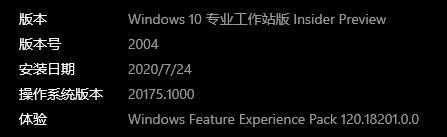
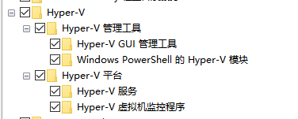
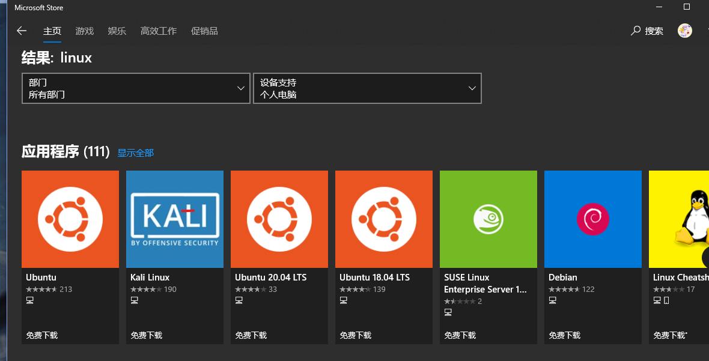

# 在Windows上获取一套方便好用的Linux子系统

作为最为优秀的linux发行版--windows10（无疑），其上发行的linux子系统在经过一次又一次的迭代更新后，与windows本体的结合越来越完美。Win10 结合 WSL 是很美好的使用方式

## 简介

> The Windows Subsystem for Linux lets developers run a GNU/Linux environment -- including most command-line tools, utilities, and applications -- directly on Windows, unmodified, without the overhead of a traditional virtual machine or dualboot setup.

wsl是微软在自家windows操作系统上所引入的一个特殊的Linux发行版，为开发人员提供了较为完善的linux系统体验，同时能一定程度上减少虚拟机所带来的性能损耗

而`wsl2`是完全不同于wsl的一个版本。wsl2是属于`hyper-v`的虚拟机，其提供了完整的linux内核(**systemd除外**)，能够较为完美地解决wsl架构上所带来的兼容问题

> 在这里个人非常推荐直接使用wsl2的版本

## wsl2

### 好处

- 轻量，使用快捷
- 能在windows上直接进行linux开发
- 能与windows一定程度上实现交互
- 避免了虚拟机无法完整利用系统资源的问题
- 定制性强，能根据个人使用习惯进行不同的调整

### 不足

- 网络问题
- 内存的回收与释放不是太好

## 安装

### 系统要求

如果想要升级wsl2，首先还是得先配置wsl，但是wsl2必须先得将系统升级到2004,至少操作系统版本得在19000+



同时需要在控制面版中开启`hyper-v虚拟机平台`及`子系统的支持`




### 版本

先在powershell中运行以下语句，设置默认版本为2

```powershell
wsl --set-default-version 2
```

再安装上内核更新包

<https://wslstorestorage.blob.core.windows.net/wslblob/wsl_update_x64.msi>

去商店找一个自己喜欢的版本就可以了



这里我比较喜欢用debian系的`ubuntu`，直接下载即可

在下载完成后第一次打开需要进行初始化，如果在无错误情况的发生下，此时应该会让你输入`用户名`和`密码`（如果想直接用root权限就直接关闭窗口**重新打开**即可）


如果想设置默认用户的话可以在powershell中输入

```powershell
xxx.exe config --default-user xxx
```

## 基本使用

### 换源

#### apt

这里源的话个人推荐`清华源`，算是源里比较稳定的了

> 这里以ubuntu20.04换源为例

1. 访问tuna的镜像站 <https://mirrors.tuna.tsinghua.edu.cn/help/ubuntu/>
2. 复制并替换/etc/apt/sources.list里的内容
3. apt update && apt upgrade

#### pip

直接修改`~/.pip/pip.conf`(没有就创建一个)

```text
[global]
index-url = xxx
```

国内镜像源:

- 阿里云 <http://mirrors.aliyun.com/pypi/simple/>
- 中国科技大学 <https://pypi.mirrors.ustc.edu.cn/simple/>
- 豆瓣(douban) <http://pypi.douban.com/simple/>
- 清华大学 <https://pypi.tuna.tsinghua.edu.cn/simple/>
- 中国科学技术大学 <http://pypi.mirrors.ustc.edu.cn/simple/>

### 代理

国内直接访问github的速度还是有点慢，而且不稳定，如果有代理的话可以配置代理实现加速（本人用的clash）

在主机上设置好通过lan口共享代理后，直接将以下内容复制到`~/.bashrc`即可

```bash
## Wsl2 proxy setting
export hostip=$(cat /etc/resolv.conf |grep -oP '(?<=nameserver\ ).*')
export port = xxx
export https_proxy="http://${hostip}:${port}"
export http_proxy="http://${hostip}:${port}"
export all_proxy="socks5://${hostip}:${port}"
## proxy setting end
```

之后刷新bash

```shell
source ~/.bashrc
```

这样在wsl中应该就能实现代理的效果了

### 美化

虽说只是终端样式，但是配置好了还是格外耐看的

#### 终端

这里我用的终端是微软自家的`windows terminal`，可以根据自己的需求来进行更换

```json
// This file was initially generated by Windows Terminal 1.0.1811.0
// It should still be usable in newer versions, but newer versions might have additional
// settings, help text, or changes that you will not see unless you clear this file
// and let us generate a new one for you.

// To view the default settings, hold "alt" while clicking on the "Settings" button.
// For documentation on these settings, see: https://aka.ms/terminal-documentation
{
    "$schema": "https://aka.ms/terminal-profiles-schema",

    "defaultProfile": "{61c54bbd-c2c6-5271-96e7-009a87ff44bf}",

    // You can add more global application settings here.
    // To learn more about global settings, visit https://aka.ms/terminal-global-settings

    // If enabled, selections are automatically copied to your clipboard.
    "copyOnSelect": false,

    // If enabled, formatted data is also copied to your clipboard
    "copyFormatting": false,

    // A profile specifies a command to execute paired with information about how it should look and feel.
    // Each one of them will appear in the 'New Tab' dropdown,
    //   and can be invoked from the commandline with `wt.exe -p xxx`
    // To learn more about profiles, visit https://aka.ms/terminal-profile-settings
    "profiles":
    {
        "defaults":
        {
            // Put settings here that you want to apply to all profiles.
        },
        "list":
        [
            {
                // Make changes here to the powershell.exe profile.
                "guid": "{61c54bbd-c2c6-5271-96e7-009a87ff44bf}",
                "name": "Windows PowerShell",
                "commandline": "powershell.exe",
                "colorScheme": "cyberpunk",
                "fontFace": "Sarasa Term SC",
                "fontSize": 15,
                "hidden": false
            },
            {
                "guid": "{2c4de342-38b7-51cf-b940-2309a097f518}",
                "hidden": false,
                "name": "Ubuntu",
                "icon": "ms-appdata:///roaming/ubuntu.png",
                "colorScheme": "cyberpunk",
                "fontFace": "Sarasa Term SC",
                "fontSize": 15,
                "startingDirectory": "/root",
                "source": "Windows.Terminal.Wsl"
            },
            {
                "guid": "{46ca431a-3a87-5fb3-83cd-11ececc031d2}",
                "hidden": false,
                "name": "kali-linux",
                "icon": "ms-appdata:///roaming/kali.png",
                "colorScheme": "cyberpunk",
                "fontFace": "Sarasa Term SC",
                "fontSize": 15,
                "source": "Windows.Terminal.Wsl"
            },
            {
                // Make changes here to the cmd.exe profile.
                "guid": "{0caa0dad-35be-5f56-a8ff-afceeeaa6101}",
                "name": "命令提示符",
                "commandline": "cmd.exe",
                "hidden": false
            },
            {
                "guid": "{b453ae62-4e3d-5e58-b989-0a998ec441b8}",
                "hidden": false,
                "name": "Azure Cloud Shell",
                "source": "Windows.Terminal.Azure"
            }
        ]
    },

    // Add custom color schemes to this array.
    // To learn more about color schemes, visit https://aka.ms/terminal-color-schemes
    "schemes": [
        {
            "name": "cyberpunk",
            "black": "#000000",
            "red": "#ff7092",
            "green": "#00fbac",
            "yellow": "#fffa6a",
            "blue": "#00bfff",
            "purple": "#df95ff",
            "cyan": "#86cbfe",
            "white": "#ffffff",
            "brightBlack": "#000000",
            "brightRed": "#ff8aa4",
            "brightGreen": "#21f6bc",
            "brightYellow": "#fff787",
            "brightBlue": "#1bccfd",
            "brightPurple": "#e6aefe",
            "brightCyan": "#99d6fc",
            "brightWhite": "#ffffff",
            "background": "#332a57",
            "foreground": "#e5e5e5"
          }
    ],

    // Add custom keybindings to this array.
    // To unbind a key combination from your defaults.json, set the command to "unbound".
    // To learn more about keybindings, visit https://aka.ms/terminal-keybindings
    "keybindings":
    [
        // Copy and paste are bound to Ctrl+Shift+C and Ctrl+Shift+V in your defaults.json.
        // These two lines additionally bind them to Ctrl+C and Ctrl+V.
        // To learn more about selection, visit https://aka.ms/terminal-selection
        { "command": {"action": "copy", "singleLine": false }, "keys": "ctrl+c" },
        { "command": "paste", "keys": "ctrl+v" },

        // Press Ctrl+Shift+F to open the search box
        { "command": "find", "keys": "ctrl+shift+f" },

        // Press Alt+Shift+D to open a new pane.
        // - "split": "auto" makes this pane open in the direction that provides the most surface area.
        // - "splitMode": "duplicate" makes the new pane use the focused pane's profile.
        // To learn more about panes, visit https://aka.ms/terminal-panes
        { "command": { "action": "splitPane", "split": "auto", "splitMode": "duplicate" }, "keys": "alt+shift+d" }
    ]
}
```

我把自己的配置放在这里，以便之后使用，这里的选项只是一角，可以去<https://aka.ms/terminal-profiles-schema>自行查找并配置

#### zsh

zsh相对于自带的bash来说算是不二之选了，安装也相当简单

1. apt install zsh
2. sh -c "$(curl -fsSL https://raw.github.com/ohmyzsh/ohmyzsh/master/tools/install.sh)"

不报错的情况下这样就已经完成安装了，剩下的就是挑选主题与插件了，这里放下自己的配置

```text
plugins=(git
        )

ZSH_THEME="ys"
```

剩下的使用就与普通的linux相差无几了

## 管理工具

### wsl

常用指令

```shell
wsl -l -v  查看版本及已安装的wsl内容
wsl --shutdown  关闭所有已启动的虚拟机
wsl --update  升级内核版本

wsl --set-default-version n  设置默认安装的版本
```

### lxrunoffline

lxrunoffline是一款强大的wsl管理工具

这里就直接放出大佬的记录

[LxRunOffline 使用教程 - WSL 自定义安装、备份](https://p3terx.com/archives/manage-wsl-with-lxrunoffline.html)
