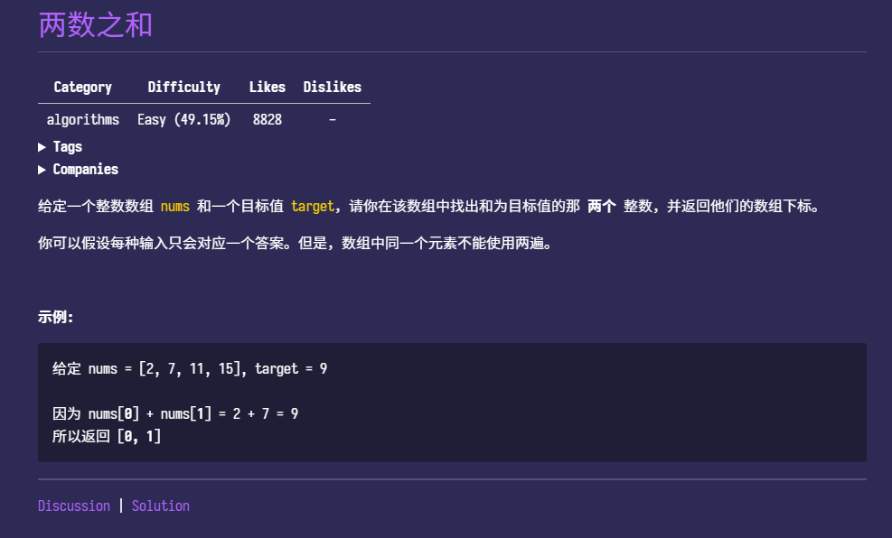

# 1. 两数之和



## 分析

题目要求我们在数组中找出两个相加等于目标数字的数，这样来我们可以有这样的思路

1. 暴力破解
**两层循环**一个个尝试，找到了就返回下标，没找到就返回为空

> 这样我还想过用相减的方法，在数组中用`std::find`找到另外一个符合的数，但这样好像和两层循环差不多了，而且这个方法需要`algorithm`这个头文件作为支持，不是太合适

2. 哈希表寻找
我们可以用哈希表的形式装下每个元素的值与位置，这样就能直接找到两个元素的位置了

## 解答

1. 暴力破解

```cpp
vector<int> twoSum(vector<int>& nums, int target) {
    int len = nums.size();
    for (int i = 0; i < len; i++) {
        for (int j = i + 1; j < len; j++) {
            if (nums[i] + nums[j] == target) {
                return {i, j};
            }
        }
    }

    return {};
}
```

2. 哈希表

```cpp
vector<int> twoSum(vector<int> &num, int target) {
    unordered_map<int, int> numMap;

    int i = 0;
    for (; i < num.size(); i++) {
        numMap[num[i]] = i;
    }

    for (i = 0; i < num.size(); i++) {
        if (numMap.find(target - num[i]) != numMap.end() && numMap[target - num[i]] != i) {
            return {i, numMap[target - num[i]]};
        }
    }

    return {};
}
```

## 补充

看了题解之后才发现还有另外一种解法，这里分析下

- 一遍哈希

```cpp
vector<int> twoSum(vector<int> &num, int target) {
    unordered_map<int, int> numMap;

    int i;
    for (i = 0; i < num.size(); i++) {
        if (numMap.find(target - num[i]) != numMap.end() && numMap[target - num[i]] != i) {
            return {i, numMap[target - num[i]]};
        }
        numMap[num[i]] = i;
    }

    return {};
}
```

思想和两遍哈希差不多，但是这个搜索的话一次只要搜索i个
