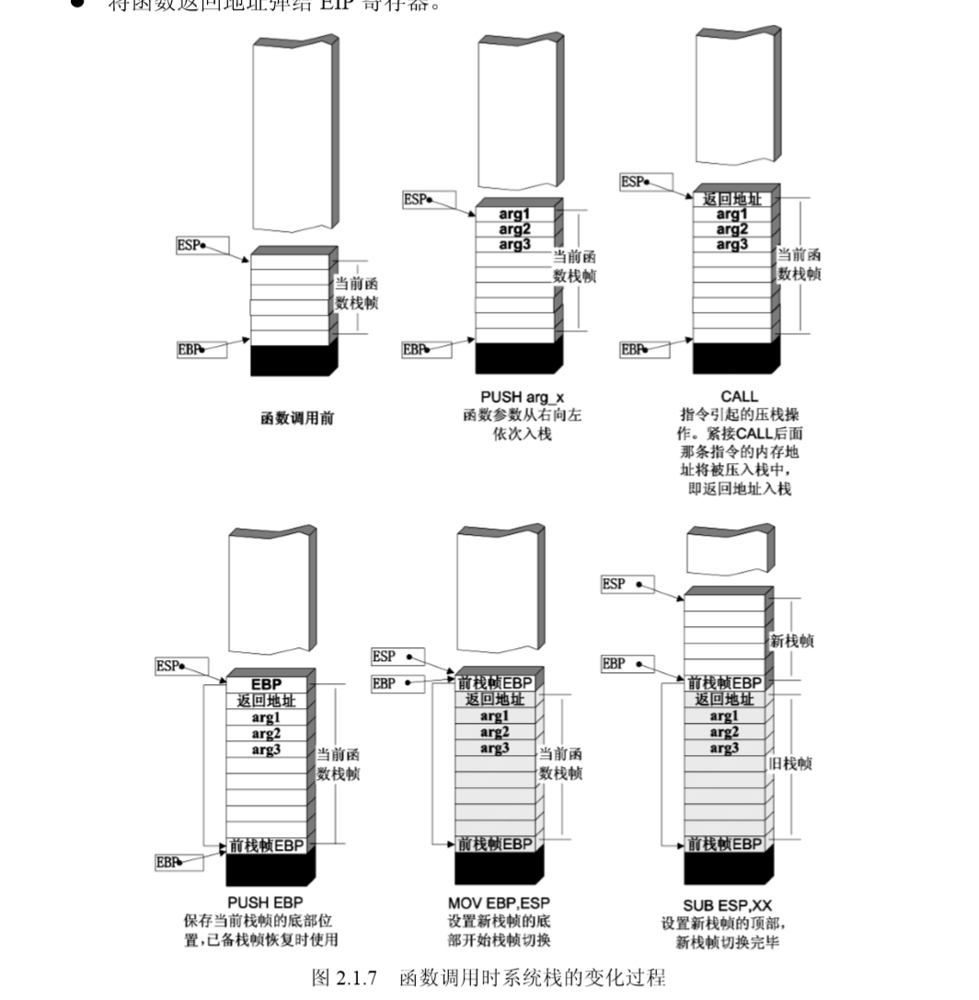

# 栈

一般来说，栈是从**高地址向低地址增长**的，压栈操作使栈顶的地址减小，弹出操作使栈顶的地址增大

一整个动态生成的结构称为是一个`栈帧`

这里介绍几个与栈相关的寄存器(32位下)

- ebp：基址指针寄存器(extended base pointer)，在这个寄存器中存放着一个指针，永远指向当前栈帧的栈底（ebp在当前栈帧内位置固定，故函数中对大部分数据的访问都基于ebp进行）
- esp：栈指针寄存器(extended stack pointer)，其内存放着一个指针，该指针永远指向系统栈最上面一个栈帧的栈顶
- eip：指令寄存器(extended instruction pointer)，其内存放着一个指针，该指针永远指向下一条等待执行的指令地址。 可以说如果控制了EIP寄存器的内容，就控制了进程——我们让eip指向哪里，CPU就会去执行哪里的指令。eip可被jmp、call和ret等指令隐含地改变(事实上它一直都在改变)(ret指令就是把当前栈顶保存的返回值地址 弹到eip中)

再介绍几个与栈操作相关的汇编代码：

- PUSH：把目标值压栈，同时`*SP`指针-1字长
- POP：将栈顶的值弹出至目的存储位置，同时SP指针+1字长
- LEAVE：在函数返回时，恢复父函数栈帧的指令
  - 等于 MOV ESP, EBP | POP EBP
- RET：在函数返回时，控制程序执行流返回父函数的指令
  - 等于 POP EIP（这条指令实际是不存在的，不能直接向EIP寄存器传送数据）
- LEA：把源操作数的有效地址送给指定的寄存器

## 函数调用栈的过程

