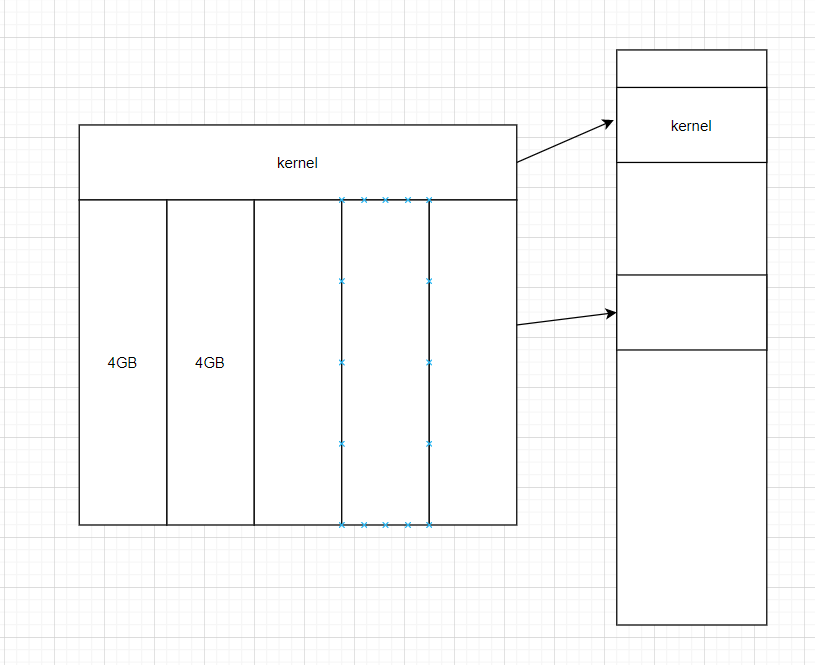
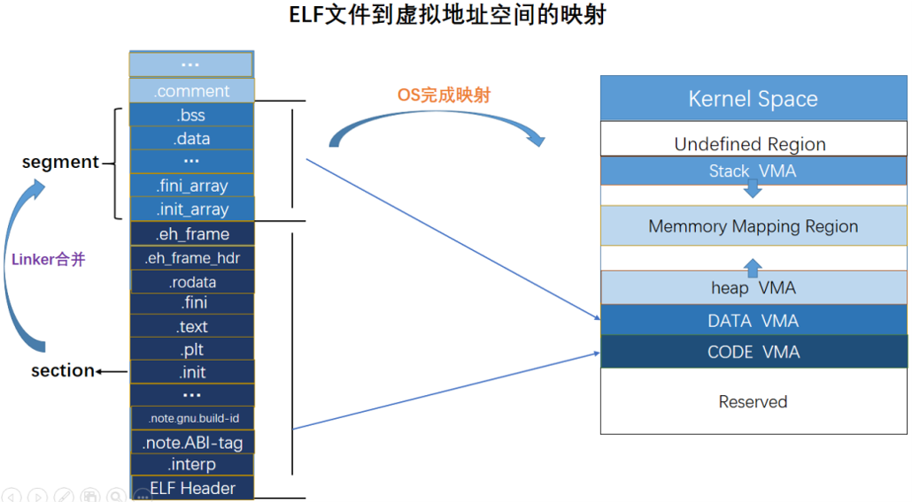
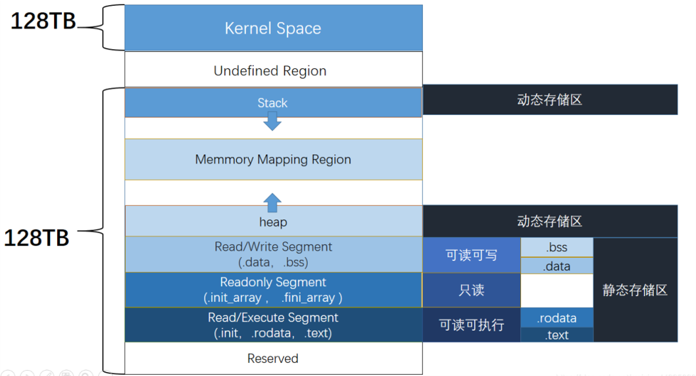

# 程序的内存布局

对于现代操作系统来说，程序一般是在`保护模式`下所运行。在这个模式下，程序都运行在一个**虚拟**的内存空间中，这个内存空间的大小一般取决于处理器的架构，一般来说：

- x86架构的处理器具有32位大小的寻址能力，对应的虚拟内存空间大小为**4GB**
- x64架构的处理器具有64位大小的寻址能力，对应的虚拟内存空间大小为**128TB**

> 保护模式是处理器的原生状态，在这种状态下，所有的指令和特性都是可用的。分配给程序的独立内存区域称为`段(Segement)`，而处理器会阻止程序使用自身段范围之外的内存

## 进程虚拟地址空间

对于一个程序来说，如果程序能够直接在物理内存中划分一块区域来供自身使用的话，从使用者的角度看是没有任何问题的，但是从安全的方面来看，这样做**直接暴露了进程所占用的真实地址空间**，能够很容易地被利用并攻击，这就直接催生了`进程虚拟地址空间`的产生

> 对于直接使用物理内存的方式，我们称之为`实地址模式`

特点：

1. 当程序在进程虚拟地址空间运行时，每个程序可以看作是独占了全部的内存，但实际上这些内存只使用了一部分的内容，整个空间是被映射到物理内存中去的
2. 虚拟内存用户空间每个进程一份，虚拟内存内核空间所有进程共享一份
3. mmap段中的动态链接库仅在物理内存中装载一份



## 从文件到内存

当程序要载入内存中运行时，它会将自身的部分合并到一个区域，并将合并过的结构按顺序加入内存中



从上到下看可以分为这几部分：

- Kernel：内核映射区域
- Stack：用于动态地存储函数之间的关系，以保证被调用函数在返回时恢复到母函数中继续执行
- Shared libraries：加载共享库地址的区域
- Heap：进程可以在堆区动态地请求一定大小的内存，并在用完之后归还给堆区。动态分配和回收是堆区的特点
- Bss: 可以用于存储未初始化的全局变量
- Data：用于存储全局变量、常量
- Text：这个区域存储着被装入执行的二进制机器代码，处理器会到这个区域取指并执行
- Unused



> 可以看出栈和堆的增长方向相反，栈由高地址向低地址增长，而对由低地址向高地址增长

> gdb中可以使用`vmmap`指令来查看内存布局

## 内存保护

linux下使用`checksec`即可查看程序的内存保护措施

### NX

> In computer security, executable-space protection marks memory regions as non-executable, such that an attempt to execute machine code in these regions will cause an exception. It makes use of hardware features such as the NX bit (no-execute bit), or in some cases software emulation of those features. However technologies that somehow emulate or supply an NX bit will usually impose a measurable overhead; while using a hardware-supplied NX bit imposes no measurable overhead.

NX即不可执行，通过在内存页的标识中增加`"执行"位`, 可以表示该内存页是否可以执行, 若程序代码的 EIP 执行至不可运行的内存页, 则 CPU 将**直接拒绝执行**"指令"造成程序崩溃

在Linux 中, 当装载器把程序装载进内存空间后, 将程序的.text 段标记为可执行, 而其余的数据段(.data, .bss 等)以及栈、堆均不可执行。如此一来, 当攻击者在堆栈上部署自己的 shellcode 并触发时, 只会直接造成程序的崩溃

```bash
gcc -o test test.c  //默认开启NX
gcc -z execstack -o test test.c //关闭NX保护
gcc -z nonexecstack -o test test.c //开启NX保护
```

### Canary

1. 在所有函数调用发生时，向栈帧内压入一个额外的随机DWORD，这个随机数被称作
"canary"，用 IDA 反汇编时，又被称作"Security Cookie"
2. canary 位于 EBP 之前，系统还会在.data 的内存区域中存放一个 canary 的副本
3. 当栈中发生溢出时，canary 将被首先淹没，之后才是 EBP 和返回地址
4. 在函数返回之前，系统将执行一个额外的安全验证操作，称作 Security Check。 5、在 Security Check 过程中，系统将比较栈帧中原先存放的 canary 和.data 中副本的值，若两者不同，则说明栈中发生了溢出，系统将进入异常处理流程，函数不会正常返回

```bash
gcc -o test test.c  // 默认情况下，不开启Canary保护
gcc -fno-stack-protector -o test test.c  //禁用栈保护
gcc -fstack-protector -o test test.c   //启用堆栈保护，不过只为局部变量中含有 char 数组的函数插入保护代码
gcc -fstack-protector-all -o test test.c //启用堆栈保护，为所有函数插入保护代码
```

### 地址随机化

#### ASLR

ASLR(Address Space Layout Randomization, 地址空间布局随机化)技术意在将程序的**内存布局随机化**, 使得攻击者不能轻易地得到数据区的地址来构造攻击载荷

由于程序的堆、栈分配与共享库的装载都是在运行时进行, 系统在程序每次执行时, 随机地分配程序堆栈的地址以及共享库装载的地址。尽管它们之间的相对位置没有改变, 但每次执行的差异仍然是页级的, 攻击者将无法预测自己写入的数据区的确切虚拟地址

```text
0 - 表示关闭进程地址空间随机化
1 - 表示将mmap的基址，stack和vdso页面随机化
2 - 表示在1的基础上增加栈（heap）的随机化
```

```bash
echo $level > /proc/sys/kernel/randomlize_va_space

// Default is 2
```

#### PIE

Position-Independent-Executable，位置无关可执行文件。ASLR 将程序运行时的堆栈以及共享库的加载地址随机化, 而 PIE 技术则在编译时将程序编译为位置无关, 即程序运行时各个段（如代码段等）加载的虚拟地址也是在装载时才确定

```bash
// pie默认关闭
gcc -fpie -pie // 打开pie
```

需要注意的是，**PIE只是在编译的过程中赋予了ELF加载到内存时其加载基址随机化的功能**，也就是说PIE编译出来的ELF如果在**ASLR=0的情况下，ELF的加载基址也是不会变**的

### RELRO

RELRO(RELocation Read-Only, 重定位只读), 此项技术主要针对 GOT 改写的攻击方式。分为部分RELRO(Partial RELRO)与完全 RELRO(Full RELRO) 两种

- 部分 RELRO: 在程序装入后, 将其中一些段(如.dynamic)标记为只读, 防止程序的一些重定位信息被修改。
- 完全 RELRO: 在部分 RELRO 的基础上, 在程序装入时, 直接解析完所有符号并填入对应的值, 此时所有的GOT表项都已初始化, 且不装入link_map与_dl_runtime_resolve的地址

```bash
gcc -z norelro -o test test.c // 完全关闭
gcc -z lazy -o test test.c // 部分关闭
gcc -z now -o test test.c // 完全打开
```

## Reference

- [ctf pwn中的缓解机制及其原理](https://eternalsakura13.com/2018/03/25/aslr/)
- [RELRO分析](https://hardenedlinux.github.io/2016/11/25/RelRO.html)
- [-pie和-fPIE选项](https://richardustc.github.io/2013-05-21-2013-05-21-pie.html)
- [关于Linux下ASLR与PIE的一些理解](https://www.cnblogs.com/rec0rd/p/7646857.html)
