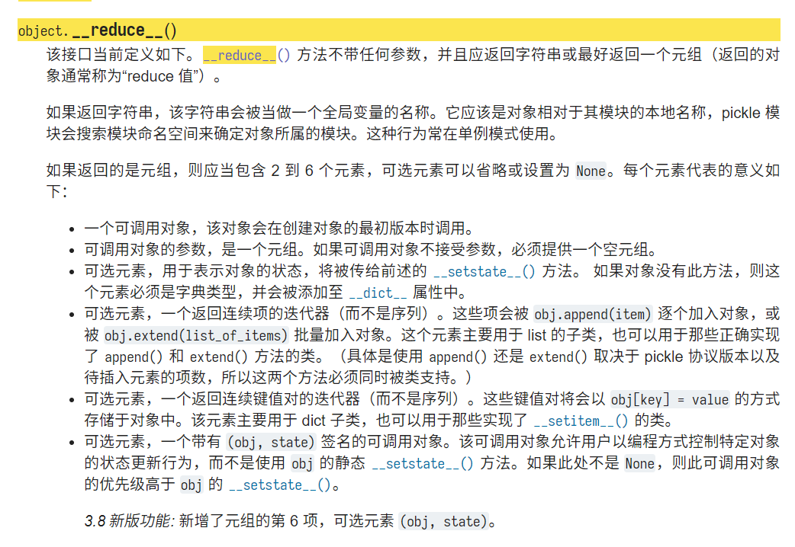

# Python 反序列化的学习与利用

## 基础知识

### pickle模块

在python中我们主要是使用`pickle`这个库来实现序列化与反序列的过程，python中`几乎所有的数据类型`（列表，字典，集合，类等）都可以用pickle来序列化

这里先引入我们所需要的对象

```python
import pickle

class People(object):
    def __init__(self, name = "a4tur0r@"):
        self.name = name

    def __str__(self):
        return "Hello! %s" % (self.name)
```

在pickle模块下提供了四种方法

#### 1. pickle.dump(obj, file, protocol=None, *, fix_imports=True)

将对象 obj 封存以后的对象写入已打开的`文件对象`中。可供选择的协议参数是一个整数，指定pickler使用的`协议版本`，支持的协议是0到HIGHEST_PROTOCOL。如果未指定，则默认为`DEFAULT_PROTOCOL`。如果指定为负数，则选择HIGHEST_PROTOCOL

```python
with open("file.pickle", "wb") as f:
    pickle.dump(b, f, pickle.HIGHEST_PROTOCOL)
```

#### 2. pickle.dumps(obj，protocol = None，*，fix_imports = True)

将对象的pickled表示作为bytes对象返回，而不是将其写入文件

```python
a = People()
pickle.dumps(a)

# output
# b'\x80\x03c__main__\nPeople\nq\x00)\x81q\x01}q\x02X\x04\x00\x00\x00nameq\x03X\x08\x00\x00\x00a4tur0r@q\x04sb.'
```

#### 3. pickle.load(file，*，fix_imports = True，encoding ="ASCII"，errors ="strict")

从打开的文件对象 文件中读取pickle对象表示，并返回其中指定的重构对象层次结构

```python
b = pickle.load("file.pickle")
print(b)

# output
# Hello! a4tur0r@
```

#### 4. pickle.loads(bytes_object，*，fix_imports = True，encoding ="ASCII"，errors ="strict")

从bytes对象读取pickle对象层次结构并返回其中指定的重构对象层次结构

```python
b = pickle.loads()
print(b)
```

在不同的版本中pickle序列化有不同的协议

> - v0 版协议是原始的“人类可读”协议，并且向后兼容早期版本的 Python。
> - v1 版协议是较早的二进制格式，它也与早期版本的 Python 兼容。
> - v2 版协议是在 Python 2.3 中引入的。它为存储 new-style class 提供了更高效的机制。欲了解有关第 2 版协议带来的改进，请参阅 PEP 307。
> - v3 版协议是在 Python 3.0 中引入的。 它显式地支持 bytes 字节对象，不能使用 Python 2.x 解封。这是 Python 3.0-3.7 的默认协议。
> - v4 版协议添加于 Python 3.4。它支持存储非常大的对象，能存储更多种类的对象，还包括一些针对数据格式的优化。它是Python 3.8使用的默认协议。有关第 4 版协议带来改进的信息，请参阅 PEP 3154。
> - 第 5 版协议是在 Python 3.8 中加入的。 它增加了对带外数据的支持，并可加速带内数据处理。 请参阅 PEP 574 了解第 5 版协议所带来的改进的详情。

这里贴出0-4版协议的结果

```text
# v-0
b'ccopy_reg\n_reconstructor\np0\n(c__main__\nPeople\np1\nc__builtin__\nobject\np2\nNtp3\nRp4\n(dp5\nVname\np6\nVa4tur0r@\np7\nsb.'

# v-1
b'ccopy_reg\n_reconstructor\nq\x00(c__main__\nPeople\nq\x01c__builtin__\nobject\nq\x02Ntq\x03Rq\x04}q\x05X\x04\x00\x00\x00nameq\x06X\x08\x00\x00\x00a4tur0r@q\x07sb.'

#v-2
b'\x80\x02c__main__\nPeople\nq\x00)\x81q\x01}q\x02X\x04\x00\x00\x00nameq\x03X\x08\x00\x00\x00a4tur0r@q\x04sb.'

#v-3
b'\x80\x03c__main__\nPeople\nq\x00)\x81q\x01}q\x02X\x04\x00\x00\x00nameq\x03X\x08\x00\x00\x00a4tur0r@q\x04sb.'

#v-4
b'\x80\x04\x950\x00\x00\x00\x00\x00\x00\x00\x8c\x08__main__\x94\x8c\x06People\x94\x93\x94)\x81\x94}\x94\x8c\x04name\x94\x8c\x08a4tur0r@\x94sb.'
```

可以看出版本越高结构越为抽象，而我们一般手写的话是使用`v-0`版本的进行书写，python会根据格式自动选择反序列化的方式

### PVM虚拟机

> <https://media.blackhat.com/bh-us-11/Slaviero/BH_US_11_Slaviero_Sour_Pickles_Slides.pdf>

pickle 是一种栈语言，有不同的编写方式，基于一个轻量的`PVM`（Pickle Virtual Machine）

#### 组成

PVM 由三个部分组成，`引擎`（或者叫指令分析器），`栈区`、还有一个`Memo`，分别用来处理、储存以及标记数据

1. 指令处理器
从流中读取`opcode`和`参数`，并对其进行解释处理。重复这个动作，直到遇到`.`这个结束符后停止，最终留在栈顶的值将被作为反序列化对象返回
2. stack
由 Python 的 list 实现，被用来临时存储数据、参数以及对象
3. memo
由 Python 的 dict 实现，为 PVM 的整个生命周期提供存储

#### 指令格式

对于指令，我们有以下的书写规范

- 操作码是单字节的
- 带参数的指令用换行符定界

#### opcode

这里贴上`1FONLY`师傅总结的opcode

```text
S : 后面跟的是字符串
( ：作为命令执行到哪里的一个标记
t ：将从 t 到标记的全部元素组合成一个元祖，然后放入栈中
c ：定义模块名和类名（模块名和类名之间使用回车分隔）
R ：从栈中取出可调用函数以及元祖形式的参数来执行，并把结果放回栈中
. ：点号是结束符
```

```text
c：引入模块和对象，模块名和对象名以换行符分割。（find_class校验就在这一步，也就是说，只要c这个OPCODE的参数没有被find_class限制，其他地方获取的对象就不会被沙盒影响了）
(：压入一个标志到栈中，表示元组的开始位置
0：弹出栈项的元素并丢弃
t：从栈顶开始，找到最上面的一个(，并将(到t中间的内容全部弹出，组成一个元组，再把这个元组压入栈中
R：从栈顶弹出一个可执行对象和一个元组，元组作为函数的参数列表执行，并将返回值压入栈上
p：将栈顶的元素存储到memo（标签区）中，p后面跟一个数字，就是表示这个元素在memo中的索引
g：把memo的第n个位置的元素复制到栈顶
V、S：向栈顶压入一个（unicode）字符串
s：从栈顶弹出三个元素，一个字典，一个键名字，一个键值，把键名：键值添加进字典，然后把字典压入栈顶
```

> 详细内容可以去查看pickle.py

### 操作过程

#### 序列化

1. 从对象中提取所有属性（\_\_dict__），并将属性转为键值对
2. 写入对象类名
3. 写入第一步生成的键值对

#### 反序列化

这里重点说一下反序列化的过程，这里我们举pdf中给出的例子(这里的例子只能用于**python2**)

```text
c__builtin__
file
(S'/etc/passwd'
tR.
```

先用python自带的`pickletool`做一下分解

```text
 0: c    GLOBAL     '__builtin__ file'
18: (    MARK
19: S    STRING     '/etc/passwd'
34: t    TUPLE      (MARK at 18)
35: R    REDUCE
36: .    STOP
```

这里逐步解释下每个指令的含义

1. 首先`c`操作码代表引入模块和对象`__builtin__.file`

2. 然后`(`操作码代表压入一个标志到栈中，表示`元组的开始位置`

3. 接着`S`操作码代表向栈顶插入一个`字符串`，这里为'/etc/passwd'

4. `t`操作码代表从栈顶开始，找到最上面的MARK也就是(，并将(到t中间的内容`全部弹出`，组成一个`元组`，再把这个元组压入栈中

5. 最后`R`操作码代表从栈顶弹出两个元素，一个可执行对象和一个元组，元组作为函数的参数列表执行，并`将返回值压入栈`上。这里执行的是__builtin__.file('/etc/passwd')

6. `.`代表程序结束

总结以下

1. 获取 pickle 输入流
2. 根据opcode及内容获取属性的内容
3. 返回属性内容
4. 根据保存的类名返回一个新的对象
5. 组合新的对象以及属性

## 利用反序列化漏洞

在pickle模块的介绍上，python的网站有着这样的警告


### 1. \_\_reduce__



## 参考链接

[pickle --- Python 对象序列化](https://docs.python.org/zh-cn/3/library/pickle.html)
[smi1e -- 从balsn-ctf-pyshv学习python反序列化](https://www.smi1e.top/%E4%BB%8Ebalsn-ctf-pyshv%E5%AD%A6%E4%B9%A0python%E5%8F%8D%E5%BA%8F%E5%88%97%E5%8C%96/)
[anquanke -- Python pickle 反序列化实例分析](https://www.anquanke.com/post/id/188981)
[1FONLY -- 初探Python反序列化学习笔记](https://ifonlyddw.gitee.io/posts/20200308/#toc-heading-5)
[Bendawang -- Python反序列化漏洞的花式利用](http://www.bendawang.site/2018/04/18/Python%E5%8F%8D%E5%BA%8F%E5%88%97%E5%8C%96%E6%BC%8F%E6%B4%9E%E7%9A%84%E8%8A%B1%E5%BC%8F%E5%88%A9%E7%94%A8/)
