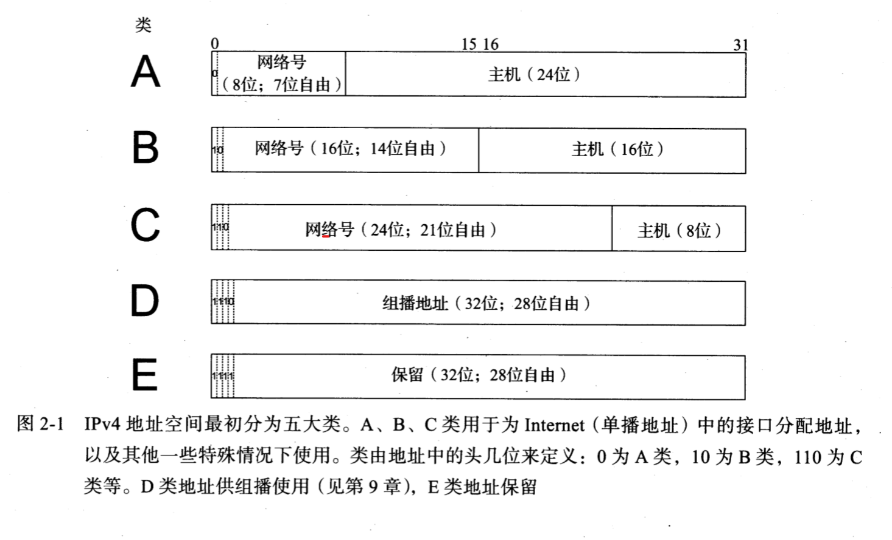
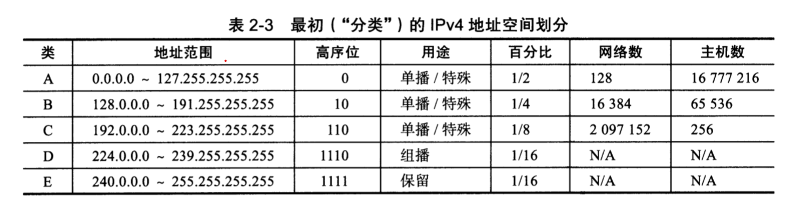
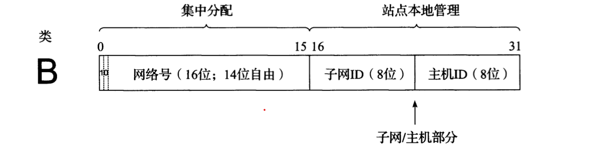

# Internet地址结构

## IP

当我们想要连接到互联网中时，我们必须要拥有一个IP地址来让服务器知道我们的位置所在，这种表示我们唯一位置的号码就是`IP`

### 分类

#### IPV4

ipv4使用十进制表示法，由四个用点号分离的`十进制数`组成，例如`192.168.111.121`，每一个十进制数字的范围均是`[0 - 2^8]`

#### IPV6

ipv6为16进制表示法，长度为128位

## 基本IP地址结构

### 分类寻址

每个单播IP都会由两部分组成

1. 网络部分
   - 作用：识别接口使用的IP地址`在哪个网络中`能够被发现
   - ip中的这部分连续号称为`网络号`
2. 主机地址
   - 作用：识别这部分网络中的特定主机
   - 这部分连续号称为是`主机号`

同时为了为不同规模的网络分配出恰当数量的主机，这里把ip的划分分为五大类，每一类基于网络中`可容纳的主机数量`

### 子网寻址

子网地址向IP中添加了一层新的结构：不同于仅有主机，网络有分为`子网与主机`。每一个子网的功能近乎于完整的网络。子网的添加构成了三层网络结构：包含子网的网络，`各自由若干主机构成`。IP地址由此被分为三个部分：`网络ID，子网ID与主机ID`

> 从家用网络设备来看，当我们想要为加入不同网络设备的终端分配ip时，我们一定不希望再从运营商获取一个新的ip，而是在现有网络的基础上再实行划分，这样就能实现网络设备的细分

> 个人理解子网虽然是从主机号里边划分出来的，但是属于网络号，理解的时候可以划分到主机号里来增加理解性

### 子网掩码

子网掩码
